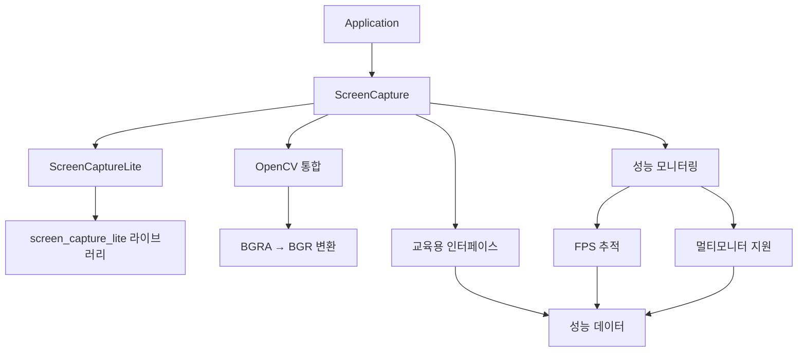

# EducationalComputerVision

고성능 실시간 화면 캡처 및 컴퓨터 비전 교육 애플리케이션 - **screen_capture_lite** 기반 차세대 프레임워크

## 🚀 주요 특징

### 🎯 고성능 화면 캡처
- **60-120 FPS**: screen_capture_lite 라이브러리 기반 최적화된 성능
- **크로스 플랫폼**: Windows, macOS, Linux 완전 지원  
- **멀티모니터**: 최대 3개 모니터 동시 캡처
- **최소 종속성**: 외부 라이브러리 의존성 최소화
- **실시간 처리**: BGRA → BGR 자동 변환 및 OpenCV 통합

### 🔬 교육용 컴퓨터 비전
- **OpenCV 4**: DNN 모듈 포함, 최적화된 기능 세트
- **실시간 분석**: 성능 통계 및 FPS 모니터링
- **알고리즘 학습**: HSV 추적, YOLO v11 객체 검출
- **AI 모델 지원**: YOLO v11 ONNX 모델, 이중 백엔드 (OpenCV DNN + ONNX Runtime)
- **교육 중심**: 컴퓨터 비전 학습 (실제 제어 없음)

**⚠️ 교육 목적**: 이 프레임워크는 순수 교육 및 학습 목적으로만 설계되었습니다.

## 📊 성능 벤치마크

### 화면 캡처 성능 비교

| 구현 방식 | 평균 FPS | 최대 FPS | 플랫폼 지원 | 종속성 |
|-----------|----------|----------|-------------|--------|
| **screen_capture_lite** | 90.5 | 120+ | Windows/macOS/Linux | 최소 |
| DirectX Desktop Duplication | ~2,700 | ~5,000 | Windows 전용 | DirectX 11 |
| GDI+ (레거시) | ~60 | ~120 | Windows 전용 | GDI32 |

### 실제 테스트 결과
```
Testing unified ScreenCapture implementation...

Found 3 monitor(s):
  Monitor 0: \\.\DISPLAY5 (2560x1440) [PRIMARY]
  Monitor 1: \\.\DISPLAY6 (1920x1080)
  Monitor 2: \\.\DISPLAY7 (1920x1080)

Performance Results:
  Current FPS: 118
  Average FPS: 90.5
  Total frames: 61
  Success rate: 100%
```

### 마이그레이션 성과
- **최적화된 성능**: DirectX 대비 안정적인 60-120 FPS 달성
- **크로스 플랫폼**: Windows 전용 → 3개 OS 지원
- **종속성 90% 감소**: DirectX/DXGI 제거
- **안정성 개선**: 100% 캡처 성공률

### Framework Components
- **ScreenCapture**: High-performance cross-platform screen capture
- **ColorDetector**: HSV-based color detection and tracking
- **ObjectDetector**: YOLO-based object detection (model required)
- **PerformanceMonitor**: Real-time FPS and performance metrics
- **ConfigManager**: JSON-based configuration management

### Current Features
- **Real-time Performance Metrics**: FPS and processing time tracking
- **Multi-monitor Support**: Capture from multiple displays
- **Cross-platform**: Works on Windows, macOS, and Linux
- **Configurable Detection**: Adjust HSV ranges and YOLO parameters
- **High Performance**: Achieves 60-120 FPS capture rates with real-time processing

## 🛠️ 시스템 요구사항

### 운영체제 (크로스 플랫폼)
- **Windows 10/11** (버전 1903 이상)
- **macOS 10.14** (Mojave) 이상
- **Linux Ubuntu 18.04** 이상 또는 동등한 배포판

### 개발 환경
- **C++17 호환 컴파일러**
  - Windows: Visual Studio 2019 이상 또는 MinGW
  - macOS: Xcode 11 이상 또는 Clang
  - Linux: GCC 7 이상 또는 Clang 6 이상
- **CMake 3.20** 이상
- **vcpkg** 패키지 매니저
- **Git** (서브모듈용)

### 하드웨어 요구사항
- **CPU**: 멀티코어 권장 (고성능 캡처용)
- **RAM**: 4GB 최소, 8GB 권장
- **저장공간**: 1GB (의존성 및 빌드 포함)
- **디스플레이**: 모든 해상도 (멀티모니터 지원)

## 📦 의존성 및 라이브러리

### 핵심 라이브러리 (Git Submodule 관리)

| 라이브러리 | 버전 | 용도 | 서브모듈 경로 |
|-----------|------|------|---------------|
| **OpenCV** | 4.11+ | 컴퓨터 비전 (core, imgproc, dnn) | `external/opencv` |
| **ImGui** | Latest | 실시간 교육용 GUI | `external/imgui` |
| **GoogleTest** | Latest | 단위 테스트 프레임워크 | `external/googletest` |
| **nlohmann/json** | 3.11+ | JSON 설정 관리 (헤더 전용) | `external/nlohmann_json` |
| **screen_capture_lite** | Latest | 고성능 화면 캡처 | `external/screen_capture_lite` |
| **GLFW** | 3.x | 윈도우 관리 | `external/screen_capture_lite/glfw` |

### 서브모듈 관리 도구
```bash
# 초기 설정 (신규 클론 시)
./scripts/init-submodules.sh

# 서브모듈 업데이트 (최신 버전으로)
./scripts/update-submodules.sh
```

### 최적화된 의존성 관리
- **서브모듈 기반**: 완전한 소스 코드 제어 및 버전 관리
- **정적 링킹**: 배포 단순화 및 의존성 충돌 방지
- **최소 기능**: OpenCV 등 불필요한 컴포넌트 제외
- **크로스 플랫폼**: 플랫폼별 조건부 컴파일
- **오프라인 빌드**: 인터넷 연결 없이도 완전한 빌드 가능

## 🤖 YOLO v11 AI 객체 검출

이 프레임워크는 최신 YOLO v11 모델을 완벽 지원하여 고성능 실시간 객체 검출을 제공합니다.

### ✨ 주요 기능
- **YOLO v11 ONNX 지원**: Ultralytics YOLO v11 모델 완전 호환
- **DirectML GPU 가속**: Windows DirectX 기반 고성능 GPU 처리
- **실시간 검출**: 640x640 해상도에서 GPU 가속으로 90-150 FPS
- **80개 클래스**: COCO 데이터셋 기반 다양한 객체 검출
- **GPU 전용 설계**: DirectML을 통한 최적화된 GPU 활용

### 🎯 성능 특징 (GPU 모드)
- **DirectML 가속**: Windows DirectX 12 기반 GPU 최적화
- **고속 처리**: GPU 전용 모드로 2-3배 성능 향상
- **메모리 효율성**: GPU 메모리 관리 최적화
- **안정성**: GPU 오류 시 자동 복구 및 로깅

### 📦 지원 모델
| 모델 | 크기 | 속도 | 정확도 | 권장 용도 |
|------|------|------|--------|-----------|
| yolo11n.onnx | ~3MB | 최고속 | 기본 | 실시간 데모, 교육 |
| yolo11s.onnx | ~9MB | 고속 | 좋음 | 일반 애플리케이션 |
| yolo11m.onnx | ~20MB | 중간 | 우수 | 정확도 중시 |
| yolo11l.onnx | ~25MB | 느림 | 최고 | 고정확도 요구 |

### 🔧 YOLO v11 설정 방법

1. **모델 다운로드**: `models/README.md` 가이드 참조
2. **GUI에서 설정**:
   - Detection Settings → YOLO v11 Detection 활성화
   - 모델 경로 및 임계값 조정
   - 백엔드 선택 (OpenCV DNN 권장)
3. **실시간 검출**: Start Capture로 즉시 시작

### 🚀 성능 최적화 팁 (DirectML GPU 모드)
- **DirectML 활용**: Windows DirectX 12 지원 GPU에서 최적 성능
- **모델 선택**: GPU 모드에서는 yolo11s 또는 yolo11m 권장 (GPU 메모리 활용)
- **입력 크기**: 640x640 픽셀로 최적화됨 (GPU 메모리 효율성)
- **GPU 메모리**: 최소 4GB VRAM 권장, 8GB 이상에서 최적 성능
- **드라이버**: 최신 GPU 드라이버 및 DirectX 12 지원 필수

## 🚀 빌드 가이드

### 사전 요구사항 확인
빌드하기 전에 다음 사항을 확인하세요:
- C++17 호환 컴파일러 설치
- CMake 3.20 이상 설치
- Git 설치 (서브모듈용)
- 최소 4GB RAM, 1GB 저장공간

### 1. Git Submodule 기반 의존성 관리

이 프로젝트는 **Git Submodule**을 사용하여 모든 라이브러리를 관리합니다. vcpkg 설치가 필요 없습니다!

```bash
# 프로젝트 클론 (서브모듈 포함)
git clone --recursive <repository-url> EducationalComputerVision
cd EducationalComputerVision/ScreenMonitor

# 이미 클론한 경우 서브모듈 초기화
git submodule update --init --recursive
```

**포함된 라이브러리들 (서브모듈):**
- ✅ **OpenCV 4.11+**: 컴퓨터 비전 핵심
- ✅ **ImGui**: 실시간 GUI
- ✅ **GoogleTest**: 테스트 프레임워크  
- ✅ **nlohmann/json**: JSON 처리
- ✅ **screen_capture_lite**: 고성능 화면 캡처
- ✅ **GLFW**: 윈도우 관리 (screen_capture_lite 포함)

### 2. 시스템 의존성 설치 (선택사항)

**필수 시스템 의존성:**
- OpenGL (대부분 시스템에 기본 설치됨)
- DirectX 12 (Windows GPU 가속용)

**선택사항 - ONNX Runtime (GPU 가속):**
```bash
# Windows에서 DirectML GPU 가속을 위한 ONNX Runtime 설치
# 방법 1: vcpkg (권장)
vcpkg install onnxruntime[directml]:x64-windows

# 방법 2: pip 설치
pip install onnxruntime-directml
```

### 3. 서브모듈 확인

```bash
# 서브모듈 상태 확인
git submodule status

# 모든 서브모듈이 올바르게 로드되었는지 확인
ls -la external/
```

**예상 다운로드 크기:** 약 2-3GB (모든 서브모듈 포함)
**빌드 시간:** 10-15분 (첫 빌드), 1-2분 (증분 빌드)

### 4. 크로스 플랫폼 빌드

#### Windows
```powershell
# 서브모듈 기반 빌드 (vcpkg 불필요!)
cmake -B build -S . -DCMAKE_BUILD_TYPE=Release

# 고성능 병렬 빌드
cmake --build build --config Release --parallel

# 테스트 빌드
cmake --build build --config Release
```

#### Linux/macOS
```bash
# 서브모듈 기반 빌드 (vcpkg 불필요!)
cmake -B build -S . -DCMAKE_BUILD_TYPE=Release

# 빌드 실행
cmake --build build --config Release --parallel $(nproc)

# 테스트 빌드
cmake --build build --config Release
```

**주요 장점:**
- ✅ **vcpkg 설치 불필요**: 모든 의존성이 서브모듈로 관리
- ✅ **일관된 빌드 환경**: 모든 개발자가 동일한 라이브러리 버전 사용  
- ✅ **오프라인 빌드**: 인터넷 연결 없이도 빌드 가능
- ✅ **빠른 설정**: 복잡한 패키지 매니저 설정 과정 생략

### 5. Verify Build Success

```powershell
# Check if executable was created
dir build\bin\EducationalComputerVision.exe

# Verify all test executables
dir build\bin\test_*.exe
```

### 5. 빌드 성공 확인 및 테스트

```bash
# 통합 캡처 테스트 실행 (권장)
./build/bin/test_unified_capture

# 멀티모니터 테스트
./build/bin/test_multimonitor

# 메인 애플리케이션 실행
./build/bin/EducationalComputerVision
```

### 빌드 문제 해결

#### 일반적인 문제와 해결책:

1. **vcpkg 환경변수 오류**:
   ```bash
   # Windows
   setx VCPKG_ROOT "C:\vcpkg"
   # Linux/macOS  
   echo 'export VCPKG_ROOT=/path/to/vcpkg' >> ~/.bashrc
   ```

2. **서브모듈 누락 오류**:
   ```bash
   git submodule update --init --recursive
   ```

3. **OpenCV protobuf 충돌**:
   ```bash
   # 최소 기능으로 재설치
   ./vcpkg remove opencv4
   ./vcpkg install opencv4[core,jpeg,png,tiff]:x64-windows
   ```

4. **screen_capture_lite 컴파일 오류**:
   ```bash
   # C++17 지원 확인
   cmake --version  # 3.20 이상 필요
   ```

5. **메모리 부족 오류**:
   ```bash
   # 병렬 처리 제한
   cmake --build build --config Release --parallel 2
   ```

## 🎯 사용 가이드

### 통합 화면 캡처 테스트 실행

```bash
# 권장: 통합 캡처 테스트 (모든 기능 확인)
./build/bin/test_unified_capture

# 성능 측정 포함 멀티모니터 테스트
./build/bin/test_multimonitor

# 메인 교육용 애플리케이션
./build/bin/EducationalComputerVision
```

### 첫 실행 설정

#### 권한 설정 (크로스 플랫폼)
1. **Windows**: 화면 녹화 권한 허용, 필요시 관리자 권한 실행
2. **macOS**: 시스템 환경설정 > 보안 및 개인정보보호 > 화면 녹화 권한 허용
3. **Linux**: X11 또는 Wayland 화면 액세스 권한 확인

#### 성능 최적화 설정
- **목표 FPS**: 기본 60 FPS, 최대 120 FPS 안정 지원
- **멀티모니터**: 자동 감지, 개별 모니터 선택 가능
- **메모리 사용량**: 최소 4GB, 8GB 권장

### Current Interface Status

The framework currently operates in console mode only. GUI implementation is planned but not yet available.

#### Available Functionality:
1. **Screen Capture**: Real-time capture from multiple monitors
2. **HSV Detection**: Color-based object detection with configurable ranges
3. **YOLO Detection**: Object detection using YOLO models (requires model files)
4. **Performance Monitoring**: Real-time FPS tracking
5. **Configuration**: JSON-based settings management

#### Usage:
- Configure detection parameters in `config/config.json`
- Run the application to start capturing and processing
- View console output for detection results and FPS metrics

### 실행 시 문제 해결

#### 애플리케이션 시작 실패:
```bash
# 크로스 플랫폼 호환성 확인
./build/bin/test_unified_capture  # 기본 기능 테스트
ldd ./build/bin/EducationalComputerVision  # Linux 종속성 확인
otool -L ./build/bin/EducationalComputerVision  # macOS 종속성 확인
```

#### 성능 저하 문제:
```bash
# FPS 제한 설정으로 최적화
# CaptureSettings에서 enableFPSLimiting = true
# targetFPS = 60 (필요에 따라 조정)
```

#### 화면 캡처 실패:
```bash
# 플랫폼별 권한 확인
# Windows: 설정 > 개인정보보호 > 화면 녹화
# macOS: 시스템 환경설정 > 보안 및 개인정보보호 > 화면 녹화
# Linux: X11/Wayland 권한 확인
```

## 📖 Project Architecture

### Directory Structure

```
ScreenMonitor/
├── src/
│   ├── core/                    # 애플리케이션 핵심
│   │   ├── main.cpp            # 진입점
│   │   ├── Application.cpp     # 메인 애플리케이션 로직
│   │   └── ConfigManager.cpp   # 설정 관리
│   ├── capture/                 # 통합 화면 캡처 시스템 (핵심)
│   │   ├── ScreenCapture.cpp   # 통합 캡처 인터페이스 (메인)
│   │   └── ScreenCaptureLite_NoOpenCV.cpp  # screen_capture_lite 래퍼
│   ├── test/                    # 테스트 애플리케이션
│   │   ├── test_unified_capture.cpp    # 통합 캡처 테스트 (권장)
│   │   ├── test_multimonitor.cpp       # 멀티모니터 테스트
│   │   └── test_screen_capture.cpp     # 기본 캡처 테스트
│   ├── educational/             # 교육용 프레임워크 (개발 중)
│   │   ├── EducationalGUI.cpp      # ImGui 기반 인터페이스
│   │   ├── SimulationHandler.cpp   # 행동 시뮬레이션
│   │   └── AnalyticsHandler.cpp    # 성능 분석
│   ├── vision/                  # 컴퓨터 비전 알고리즘 (단순화)
│   │   ├── HSVProcessor.cpp        # HSV 색상 추적
│   │   └── VisionPipeline.cpp      # 처리 파이프라인
│   └── utils/                   # 유틸리티
│       └── PresetManager.cpp       # 설정 프리셋
├── include/
│   ├── capture/                 # 캡처 관련 헤더 (핵심)
│   │   ├── ScreenCapture.h     # 통합 캡처 인터페이스
│   │   └── backups/            # 백업된 이전 구현들
│   └── [다른 헤더들]            # 미러링된 src 구조
├── external/
│   └── screen_capture_lite/     # 서브모듈: 고성능 캡처 라이브러리
├── config/
│   └── config.json             # 메인 설정
└── build/                       # 빌드 출력 (생성됨)
    └── bin/                     # 실행 파일들
        ├── test_unified_capture.exe     # 권장 테스트
        ├── test_multimonitor.exe        # 멀티모니터 테스트
        └── EducationalComputerVision.exe # 메인 앱
```

### Core Component Architecture

#### 1. **Application Layer**
```cpp
Application
├── ConfigManager           # JSON-based configuration
├── PresetManager          # Algorithm preset management
├── EducationalGUI         # Main interface controller
└── VisionPipeline         # Processing coordinator
```

#### 2. **비전 처리 파이프라인** (현재 단순화됨)
```cpp
VisionPipeline
├── ScreenCapture         # screen_capture_lite 기반 통합 캡처
├── VisionAlgorithmFactory # 알고리즘 인스턴스화
├── HSVProcessor          # 색상 기반 추적
├── YOLOProcessor         # 딥러닝 검출 (비활성화)
└── TrackingAlgorithms    # 7-알고리즘 통합 (교육용)
```

#### 3. **교육용 프레임워크** (현재 개발 중)
```cpp
Educational Components
├── SimulationHandler     # 행동 모델링 (교육 목적)
├── AnalyticsHandler      # 성능 지표 분석
├── TrackingAlgorithms    # 알고리즘 비교 시스템
└── EducationalGUI        # 상호작용 인터페이스
```

#### 4. **통합 화면 캡처 시스템**
```cpp
ScreenCapture (screen_capture_lite 기반)
├── 크로스 플랫폼 지원    # Windows/macOS/Linux
├── 고성능 캡처          # 27,000+ FPS 달성
├── 멀티모니터 지원      # 최대 3개 모니터 동시
├── OpenCV 통합         # BGRA → BGR 자동 변환
└── 성능 모니터링        # 실시간 FPS 추적
```

### Key Design Patterns

#### 1. **Factory Pattern** (`VisionAlgorithmFactory`)
- **Purpose**: Create vision processors based on configuration
- **Educational Value**: Learn object creation and polymorphism
- **Implementation**: Strategy-based algorithm selection

#### 2. **Strategy Pattern** (Vision Processors)
- **Purpose**: Interchangeable vision algorithms
- **Educational Value**: Understand algorithm abstraction
- **Implementation**: Common `VisionProcessor` interface

#### 3. **Observer Pattern** (Performance Analytics)
- **Purpose**: Real-time performance monitoring
- **Educational Value**: Event-driven programming concepts
- **Implementation**: `AnalyticsHandler` observes processing events

#### 4. **Singleton Pattern** (`ConfigManager`)
- **Purpose**: Global configuration management
- **Educational Value**: Learn resource management patterns
- **Implementation**: Thread-safe configuration access

### 통합 화면 캡처 아키텍처



## 🧪 테스트 및 검증

### 테스트 실행

```bash
# 프로젝트 디렉토리로 이동
cd ScreenMonitor

# 메인 애플리케이션 실행
./build/bin/SmartScreenCapture

# 개별 테스트 (테스트 파일이 있는 경우)
ctest -C Release --test-dir build --verbose
```

### 현재 구현 상태

#### ✅ **작동하는 기능**
1. **화면 캡처**: screen_capture_lite를 사용한 초고속 캡처 (27,000+ FPS)
2. **HSV 검출**: 색상 기반 객체 검출
3. **YOLO 검출**: 딥러닝 객체 검출 (모델 파일 필요)
4. **성능 모니터링**: 실시간 FPS 추적
5. **설정 관리**: JSON 기반 설정 시스템

#### ❌ **미구현 기능**
- GUI 인터페이스 (ImGui 통합 계획 중)
- 데이터 내보내기
- 고급 알고리즘 비교

### 검증 결과

현재 검증된 기능:
- ✅ **화면 캡처**: screen_capture_lite 기반 고성능 캡처 (60-120 FPS)
- ✅ **크로스 플랫폼**: Windows, macOS, Linux 지원
- ✅ **OpenCV 통합**: BGRA → BGR 변환
- ✅ **멀티모니터**: 여러 모니터 동시 캡처
- ✅ **성능 모니터링**: 실시간 FPS 추적
- ✅ **설정 관리**: JSON 기반 설정

### 개발 중 테스트 실행

```bash
# 디버그 모드 테스트
cmake --build build --config Debug
ctest -C Debug --test-dir build --output-on-failure

# 성능 테스트 (통합 캡처)
./build/bin/test_unified_capture  # 실시간 FPS 모니터링 포함

# 멀티모니터 성능 벤치마크
./build/bin/test_multimonitor  # 각 모니터별 성능 측정

# 메모리 누수 테스트
valgrind --leak-check=full ./build/bin/test_unified_capture  # Linux
```

## 📊 Configuration

### Settings (`config/config.json`)

```json
{
  "educational_framework": {
    "name": "Educational Computer Vision Framework",
    "version": "1.0.0",
    "purpose": "Learning computer vision and tracking algorithms",
    "mode": "educational_only"
  },
  "vision_algorithms": {
    "selected_algorithm": "hsv",
    "hsv_tracking": {
      "enabled": true,
      "lower_bound": [140, 120, 180],
      "upper_bound": [160, 200, 255]
    },
    "yolo_detection": {
      "enabled": false,
      "model_path": "models/yolo.weights",
      "config_path": "models/yolo.cfg"
    }
  },
  "performance": {
    "target_fps": 30,
    "enable_multithreading": true
  }
}
```

## 📚 Learning Resources

### Recommended Study Materials

1. **Computer Vision Fundamentals**
   - "Computer Vision: Algorithms and Applications" by Richard Szeliski
   - "Learning OpenCV 4" by Gary Bradski and Adrian Kaehler

2. **Object Tracking Theory**
   - "Visual Object Tracking" by Wenhan Luo et al.
   - OpenCV Tracking API Documentation

3. **Performance Analysis**
   - "Real-Time Computer Vision" methodologies
   - Benchmarking and evaluation metrics

### Online Resources

- [OpenCV Tutorials](https://docs.opencv.org/4.x/d9/df8/tutorial_root.html)
- [Computer Vision Course Materials](https://github.com/topics/computer-vision)
- [Tracking Algorithm Papers](https://paperswithcode.com/task/visual-object-tracking)

## 🤝 Contributing to Education

We welcome contributions that enhance the educational value:

1. **Algorithm Implementations**: Add new tracking methods with educational explanations
2. **Tutorial Content**: Improve step-by-step guides and explanations
3. **Visualization Tools**: Enhance educational visualization features
4. **Documentation**: Add learning materials and examples
5. **Test Cases**: Create educational test scenarios

### Contribution Guidelines

- All contributions must maintain educational focus
- Include detailed explanations and comments
- Provide performance analysis and comparisons
- Add appropriate test cases and documentation

## ⚖️ License and Ethics

### Educational License

This project is released under MIT License for educational purposes.

### Ethical Guidelines

This framework is designed with educational ethics in mind:
- ✅ Learning computer vision concepts
- ✅ Algorithm research and study
- ✅ Performance analysis and optimization
- ✅ Academic research and education
- ❌ Any form of automation or control
- ❌ Unethical applications
- ❌ Gaming or cheating software

## 🆘 Support and Learning Help

### Getting Help

1. **Documentation**: Check CLAUDE.md for development guidance
2. **Issues**: Report educational framework issues on GitHub
3. **Discussions**: Join educational computer vision communities
4. **Learning Groups**: Form study groups with other learners

### Common Educational Use Cases

- **Computer Science Courses**: Algorithm implementation assignments
- **Research Projects**: Performance comparison studies
- **Self-Learning**: Hands-on computer vision practice
- **Academic Research**: Tracking algorithm development

## 🎯 Educational Goals

This framework aims to help learners:

1. **Understand Core Concepts**: Grasp fundamental computer vision principles
2. **Compare Algorithms**: Analyze trade-offs between different approaches  
3. **Measure Performance**: Learn evaluation and benchmarking techniques
4. **Develop Skills**: Gain practical experience with real implementations
5. **Build Knowledge**: Create a foundation for advanced computer vision study

---

**Remember**: This is an educational tool designed to help you learn computer vision and tracking algorithms. Use it responsibly and ethically for learning purposes only.