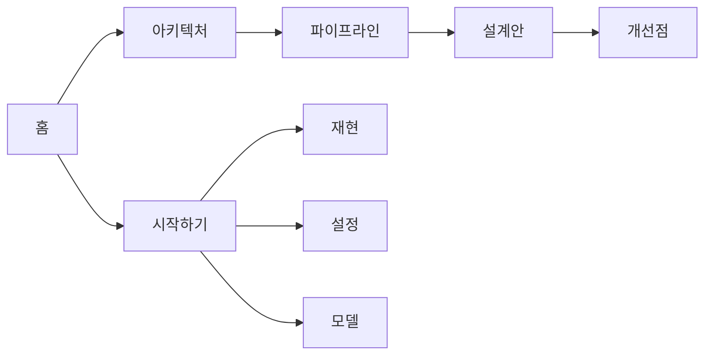

# display-share 문서

Windows 우선 **화면 캡처 + 비전 파이프라인** 앱 문서입니다.

| 항목 | 값 |
|------|-----|
| 저장소 | [NAMUORI00/display-share](https://github.com/NAMUORI00/display-share) |
| 앱 바이너리 | `smartscreencapture` (`capture-first/apps/smartscreencapture`) |
| UI 표시명 | **SmartScreenCapture** |
| 소스 | [`main`](https://github.com/NAMUORI00/display-share/tree/main) |
| 문서 소스 | [`wiki`](https://github.com/NAMUORI00/display-share/tree/wiki) |
| 이 사이트 | [GitHub Pages](https://NAMUORI00.github.io/display-share/) |
| 라이선스 | [MIT](라이선스.md) (앱 소스) |

> 로컬 폴더/이력명 `C_capture` 는 예전 이름입니다. 원격 저장소명은 `display-share` 입니다.

## 한 줄 요약

```text
DXGI Desktop Duplication (D3D11)
  → Preview/Analysis CPU 채널
  → UI 펌프 + 비전 워커 (HSV / YOLO26 ONNX)
  → egui 운영자 셸
```

- 캡처 백엔드: **DXGI only** (WGC는 미구현 · 미래 작업)
- 추론 EP: **DirectML → OpenVINO → CPU** (soft-fail)
- 개인정보 기본값: 자체 창 캡처 제외 **기본 꺼짐** (`privacy`)

## 문서 맵



### 설계 (다이어그램 중심)

1. [아키텍처](아키텍처.md) — 크레이트·스레드·캡처/추론 경계  
2. [파이프라인](파이프라인.md) — 프레임 단위 전 단계  
3. [설계안](설계안.md) — 제로카피·To-Be  
4. [개선점](개선점.md) — 병목·우선순위  

### 사용 · 재현

5. [시작하기](시작하기.md) — 빌드·실행  
6. [재현 가이드](재현-가이드.md) — 검증 체크리스트  
7. [설정](설정.md) — `config.json` / `privacy`  
8. [모델 가이드](모델-가이드.md) — YOLO26 ONNX  

### 기타

9. [라이선스](라이선스.md)  
10. [개발 현황](개발-현황.md)  

## main 브랜치 참고 파일

| 경로 | 내용 |
|------|------|
| `README.md` | 빠른 시작 |
| `LICENSE` | MIT |
| `config/config.json` | 기본 설정 |
| `models/README.md` | 모델 배치 |
| `capture-first/MIGRATION_TASKS.md` | 구현 백로그 |
