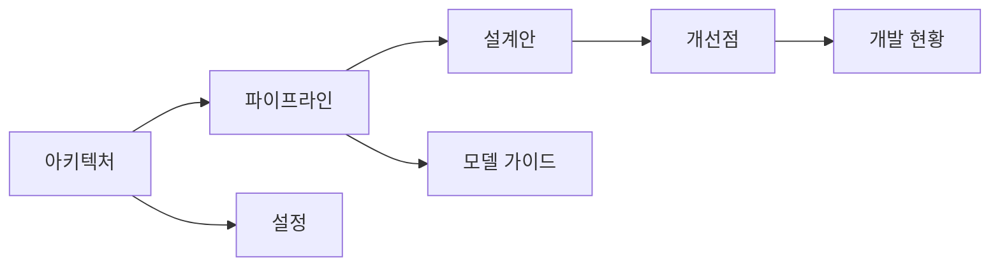

# display-share 문서

Windows 우선 **화면 캡처 + 비전 파이프라인** 프로젝트 문서 사이트입니다.  
(저장소 이력명: `C_capture` · 앱 바이너리: `display-share`)

| | |
|--|--|
| 저장소 | [NAMUORI00/display-share](https://github.com/NAMUORI00/display-share) |
| 소스 브랜치 | [`main`](https://github.com/NAMUORI00/display-share/tree/main) |
| 문서 브랜치 | [`wiki`](https://github.com/NAMUORI00/display-share/tree/wiki) |
| 문서 사이트 | [GitHub Pages](https://NAMUORI00.github.io/display-share/) |
| 소스 라이선스 | [MIT](라이선스.md) |

## 핵심 맵

## 문서 목차

### 구조 · 설계 (다이어그램 중심)

1. [아키텍처](아키텍처.md) — 크레이트 경계, 스레드 모델, As-Is/To-Be
2. [파이프라인](파이프라인.md) — 캡처→분석→추론→UI 전 단계
3. [설계안](설계안.md) — 제로카피·백엔드·검증 목표 설계
4. [개선점](개선점.md) — 병목, 트랙별 갭, 우선순위 로드맵

### 사용 · 재현

5. [시작하기](시작하기.md) — 설치 · 빌드 · 실행
6. [재현 가이드](재현-가이드.md) — 검증 체크리스트
7. [설정](설정.md) — `config.json` 필드
8. [모델 가이드](모델-가이드.md) — YOLO26 ONNX

### 기타

9. [라이선스](라이선스.md) — MIT 및 서드파티
10. [개발 현황](개발-현황.md) — 마이그레이션 트랙 요약

## 무엇을 하나요?

- **디스플레이 캡처**: Windows DXGI Desktop Duplication
- **비전**: HSV 마스크 추적, YOLO26 detect ONNX
- **추론 백엔드**: DirectML → OpenVINO → CPU (soft-fail)
- **UI**: `eframe` / `egui` 운영자 셸

## main 브랜치의 짧은 문서

| 경로 | 내용 |
|------|------|
| `README.md` | 프로젝트 개요 · 빠른 시작 |
| `LICENSE` | MIT 전문 |
| `models/README.md` | 모델 파일 배치 |
| `capture-first/MIGRATION_TASKS.md` | 구현 백로그 원문 |
