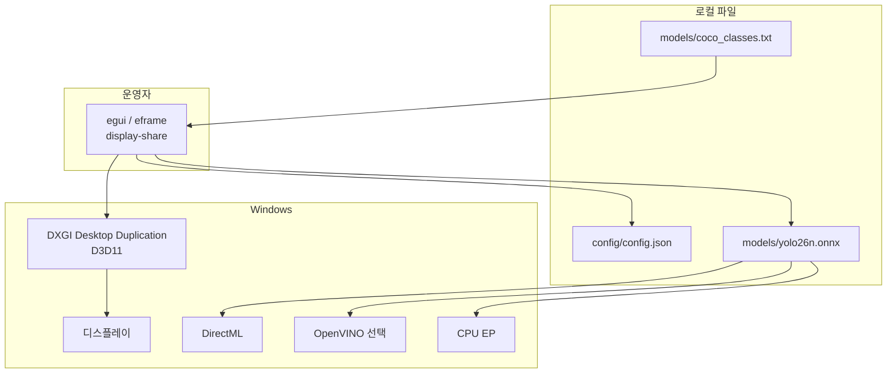
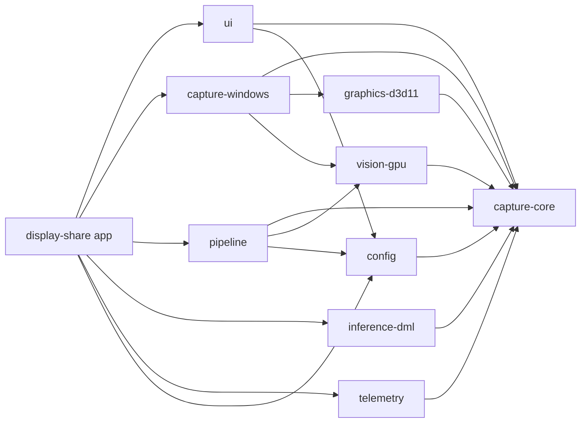
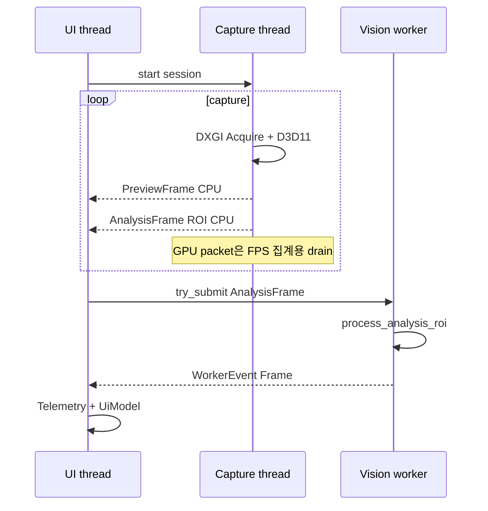
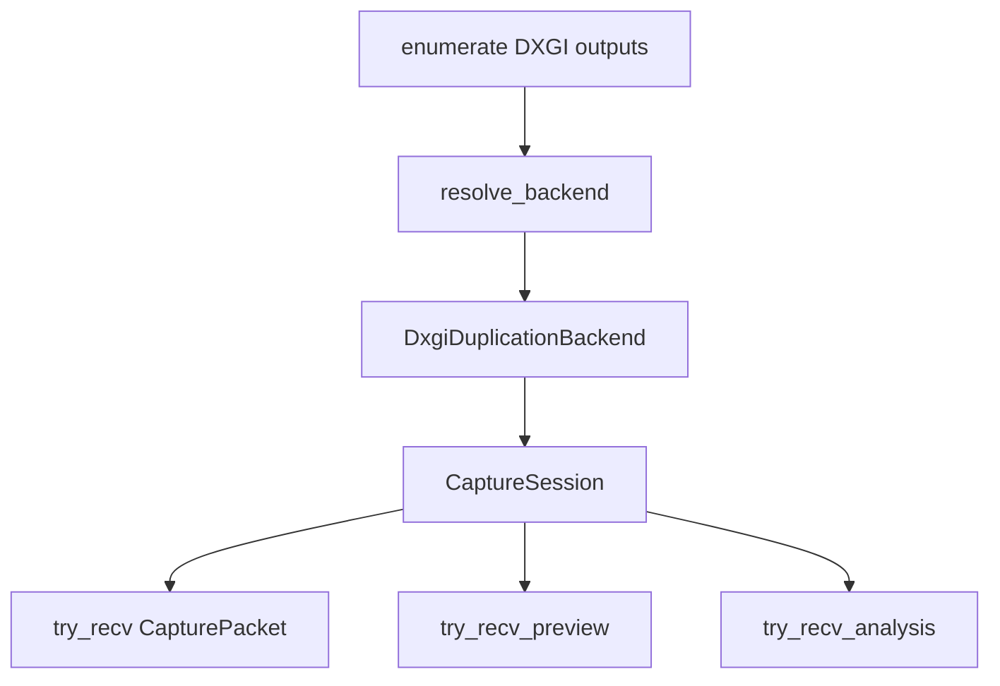
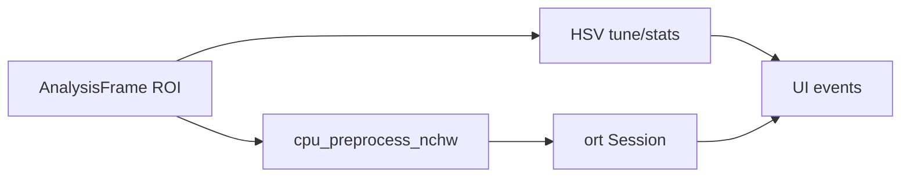
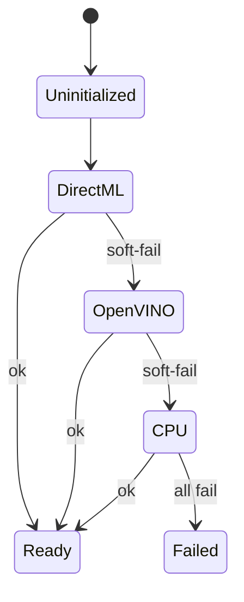
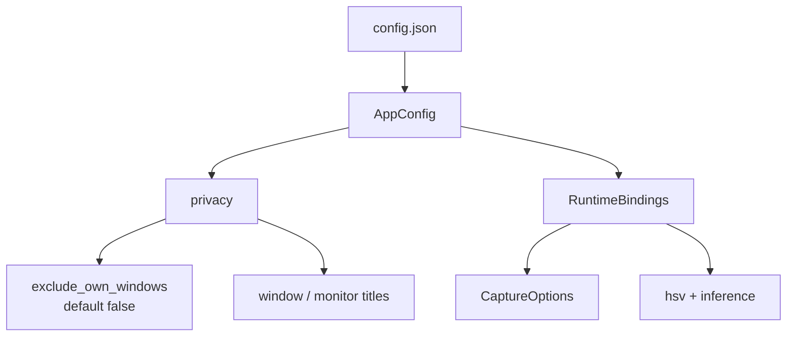
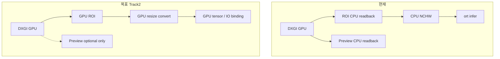

# 아키텍처

SmartScreenCapture (`display-share`) 의 **현재(As-Is)** 구조입니다.  
관련: [파이프라인](파이프라인.md) · [설계안](설계안.md) · [개선점](개선점.md)

## 1. 한 줄 요약

```text
DXGI 캡처 스레드 (D3D11 only)
  → PreviewFrame / AnalysisFrame (CPU 채널)
  → UI 펌프 + 비전 워커 (HSV / YOLO)
  → egui
```

불변 조건:

- **D3D11은 캡처 스레드 전용** — UI/비전 워커로 디바이스·텍스처를 넘기지 않음
- 분석은 **`AnalysisFrame` (ROI CPU)** 만 워커에 제출
- 추론은 `InferenceBackend` + EP soft-fail (DirectML → OpenVINO → CPU)
- 캡처 구현: **DXGI Desktop Duplication only** (WGC 미구현)

## 2. 시스템 컨텍스트



## 3. 워크스페이스 · 크레이트



| 크레이트 | 책임 |
|----------|------|
| `capture-core` | 계약·타입·identity·에러 |
| `graphics-d3d11` | D3D11 텍스처·공유 디바이스 |
| `capture-windows` | DXGI 열거·세션·preview/analysis 채널 |
| `pipeline` | ROI vs ModelInput, HSV/YOLO 라우팅, readback 정책 |
| `vision-gpu` | HSV, CPU NCHW preprocess, crop/downscale |
| `inference-dml` | ort 세션, EP 체인, YOLO 파싱 |
| `config` | JSON ↔ AppConfig / RuntimeBindings / **PrivacyConfig** |
| `telemetry` | FPS·drop 집계 |
| `ui` | egui 셸 모델 |
| `display-share` | eframe 연결, 펌프, 워커, privacy 창 제외 |

## 4. 스레드 모델



| 규칙 | 이유 |
|------|------|
| D3D11 캡처 스레드 전용 | 크로스 스레드 D3D11 금지 |
| 워커는 `process_analysis_roi` 만 | D3D11 touch 없음 |
| 워커 preview 강제 off | 미리보기는 캡처 스레드 생산 |
| GPU packet 미제출 | 분석 채널만 비전 경로 |

## 5. 캡처 서브시스템 (DXGI-only)



- `CaptureBackendPreference` 에 WGC를 줘도 **현재 구현은 DXGI로 정규화**되거나 WGC 미구현으로 fail-closed
- Preview long-edge 캡처 경로: **1920** (`capture-windows` DXGI)
- BGRA 정규, 공유 D3D11 디바이스 캐시

## 6. 비전 · 추론





## 7. 설정 · privacy · identity



| 개념 | 현재 |
|------|------|
| 표시명 기본 | SmartScreenCapture (`capture_core::identity`) |
| `privacy.exclude_own_windows_from_capture` | 기본 `false`, 켜면 로그 |
| 구 `concealment` | **제거됨** |

## 8. 핵심 타입

| 타입 | 의미 |
|------|------|
| `CaptureFrame::{D3d11,Cpu}` | GPU/CPU 프레임 |
| `CaptureRoi` | 운영자 ROI (기본 center 320×320) |
| `ModelInputSize` | YOLO 입력 (기본 640×640) — ROI와 **분리** |
| `AnalysisFrame` | 캡처 스레드 ROI CPU |
| `PreviewFrame` | 모니터 뷰 CPU |
| `TensorInputHandle` | preprocess 결과 |
| `ProviderState` | EP 상태 UI 노출 |
| `PrivacyConfig` | 창 제외·제목 문자열 |

## 9. As-Is vs To-Be



상세: [설계안](설계안.md) · [개선점](개선점.md) · [파이프라인](파이프라인.md)
