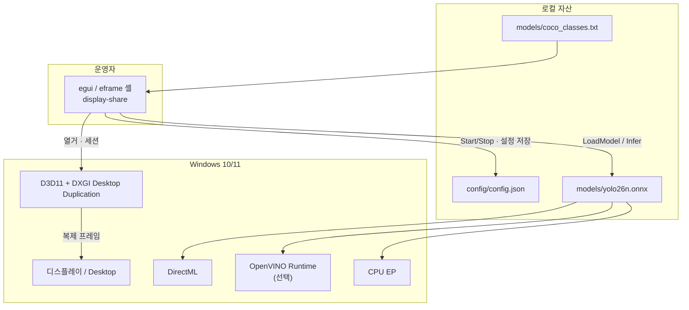
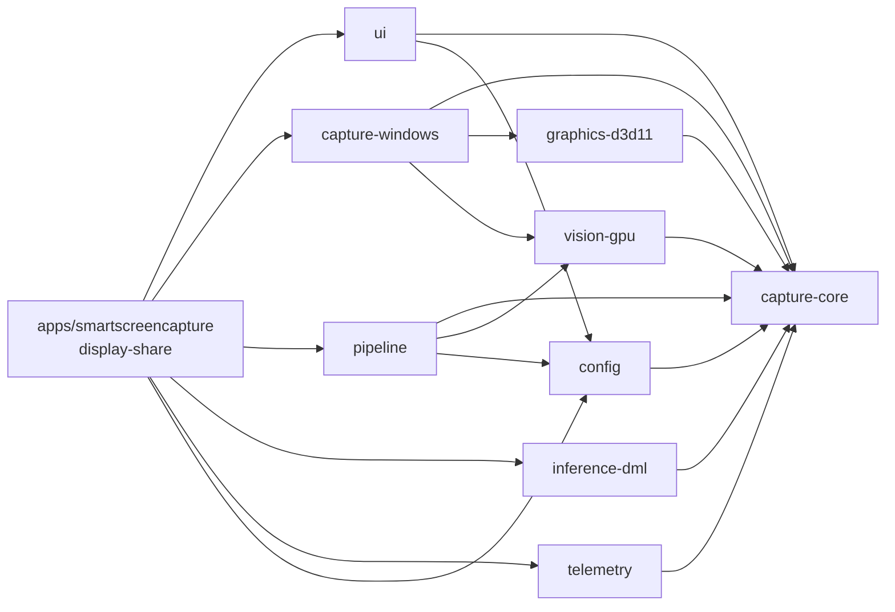
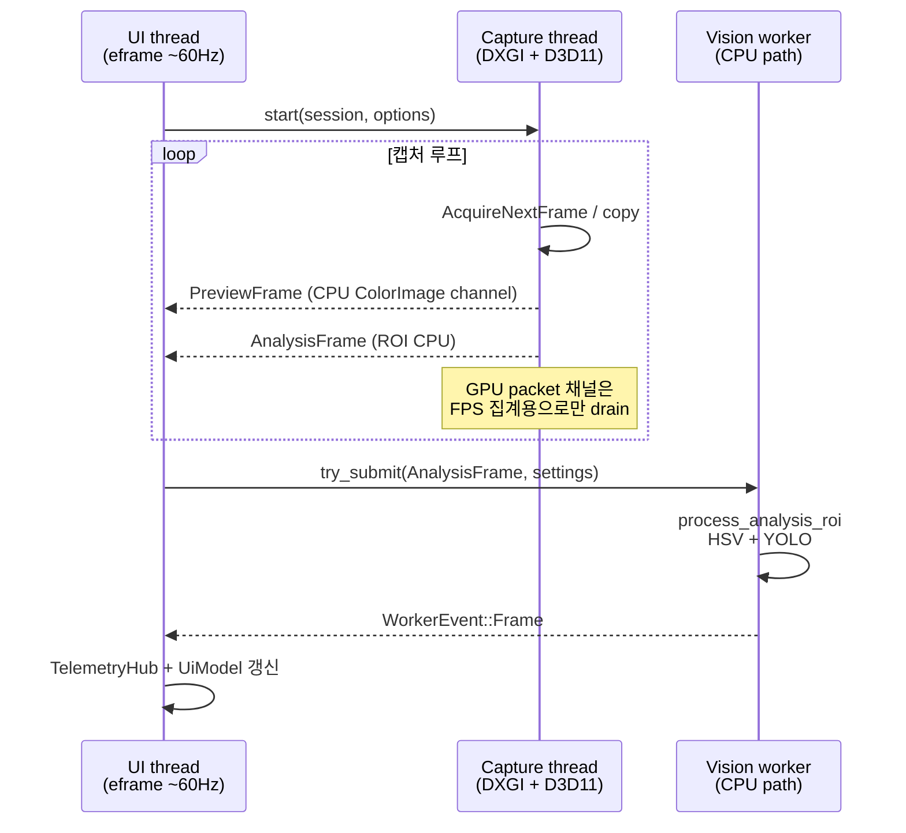
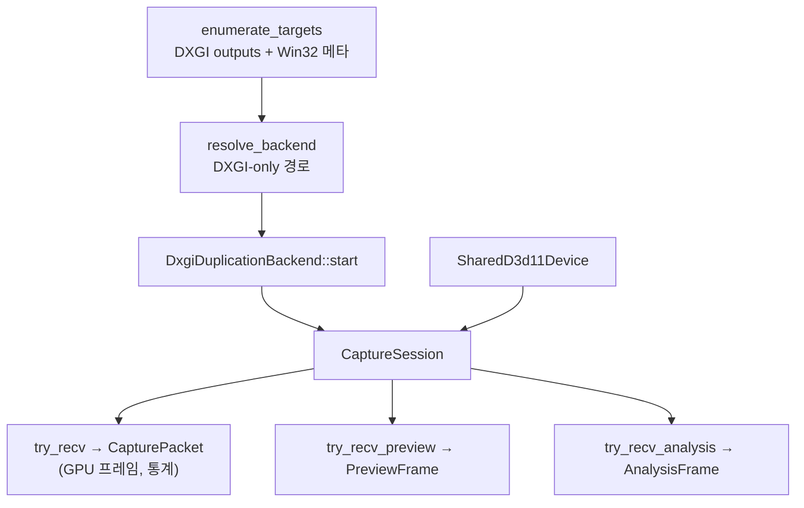
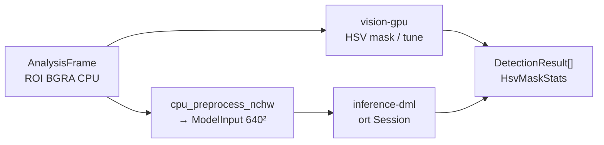
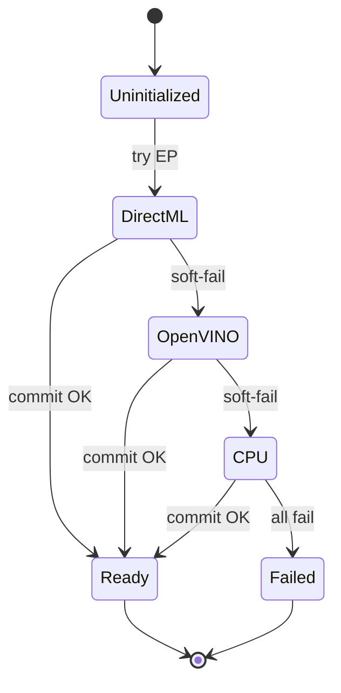
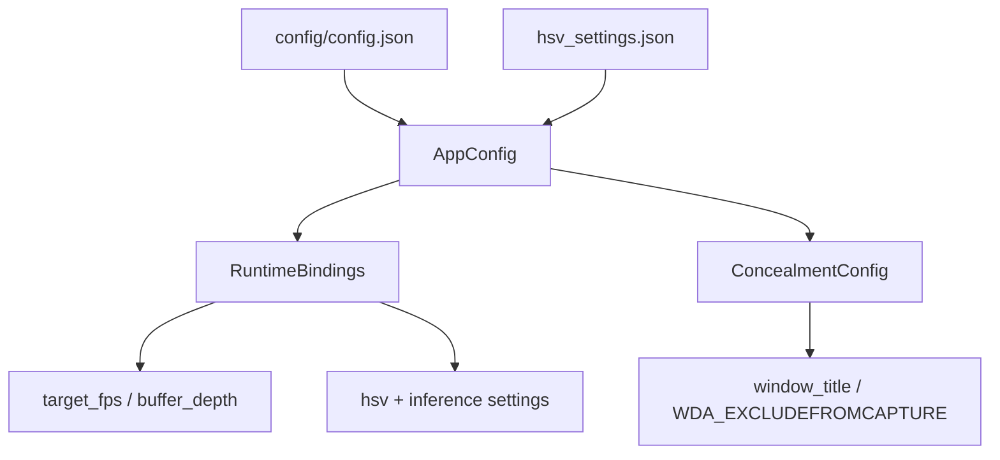
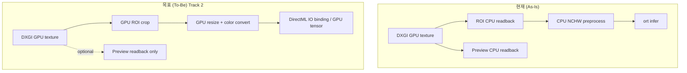

# 아키텍처

Windows 우선 화면 캡처 · 비전 추론 앱 **display-share** 의 전체 구조입니다.  
관련: [파이프라인](파이프라인.md) · [설계안](설계안.md) · [개선점](개선점.md)

## 1. 한 줄 요약

```text
DXGI 캡처 스레드(D3D11) → CPU Preview/Analysis 채널 → UI 펌프 + 비전 워커(HSV/YOLO) → egui
```

- **D3D11은 캡처 스레드에만** 머문다. UI/비전 워커로 디바이스·텍스처를 넘기지 않는다.
- 분석은 캡처 스레드가 만든 **ROI CPU 버퍼(`AnalysisFrame`)** 만 비전 워커에 제출한다.
- 추론은 `InferenceBackend` 계약 뒤에서 provider 체인(DirectML → OpenVINO → CPU)으로 soft-fail 한다.

## 2. 시스템 컨텍스트



## 3. 워크스페이스 · 크레이트 경계



| 크레이트 | 책임 | 의도적으로 하지 않는 것 |
|----------|------|-------------------------|
| `capture-core` | 계약·타입·에러·identity | D3D11 / ort 구현 |
| `graphics-d3d11` | 텍스처 핸들, 공유 디바이스 | 캡처 세션 정책 |
| `capture-windows` | DXGI 열거·세션·미리보기/분석 채널 | UI, 추론 |
| `pipeline` | ROI/ModelInput, HSV/YOLO 라우팅, readback 정책 | 스레드 소유 |
| `vision-gpu` | HSV, CPU NCHW preprocess, crop/downscale | 세션 생명주기 |
| `inference-dml` | ort 세션, EP 체인, YOLO 파싱 | 캡처 |
| `config` | JSON ↔ `RuntimeBindings` | 런타임 루프 |
| `telemetry` | FPS/drop 집계 | 로깅 백엔드 |
| `ui` | 운영자 셸 모델·레이아웃 | 캡처 펌프 세부 |
| `display-share` | eframe 셸, 스레드 연결, 창 제외 | 비즈니스 로직 비대화 방지 |

## 4. 런타임 스레드 모델



### 스레드 규칙 (불변 조건)

| 규칙 | 이유 |
|------|------|
| D3D11 디바이스/텍스처는 캡처 스레드 전용 | 크로스 스레드 D3D11 사용 금지 |
| 비전 워커는 `process_analysis_roi` 만 사용 | D3D11 touch 없음 |
| UI는 GPU `CapturePacket` 을 워커에 넘기지 않음 | FPS 카운트만 하고 폐기/스킵 |
| 미리보기 readback은 캡처 스레드에서 생산 | 워커에서 `want_preview_buffer=false` 강제 |

## 5. 캡처 서브시스템



- 현재 구현은 **DXGI Desktop Duplication only** (`capture-windows` 주석 기준).
- `CaptureBackendPreference::WindowsGraphicsCapture` 를 줘도 resolve 결과는 DXGI 로 정규화된다.
- `CaptureOptions::normalize_for_display_capture` / privacy sanitize 로 지원 범위 밖 옵션을 강제한다.

## 6. 비전 · 추론 계층



### Provider 체인



기본 순서: `["directml", "openvino", "cpu"]` (`auto`/빈 목록도 동일 확장).

## 7. 설정 · 제품 identity



## 8. 데이터 타입 핵심

| 타입 | 의미 |
|------|------|
| `CaptureFrame::{D3d11,Cpu}` | GPU/CPU 프레임 (downcast 웹 제거) |
| `CaptureRoi` | 운영자 ROI (예: 320×320 center) — **모델 입력과 분리** |
| `ModelInputSize` | YOLO 입력 (예: 640×640) |
| `AnalysisFrame` | 캡처 스레드 생산 ROI CPU 버퍼 |
| `PreviewFrame` | 모니터 뷰용 다운스케일 CPU |
| `TensorInputHandle` | preprocess 결과(+ optional `CpuNchwTensor`) |
| `ProviderState` | UI에 노출되는 EP 상태 |

## 9. 현재 vs 목표 아키텍처



상세 설계는 [설계안](설계안.md), 갭 목록은 [개선점](개선점.md), 프레임 단위 흐름은 [파이프라인](파이프라인.md)을 보세요.
