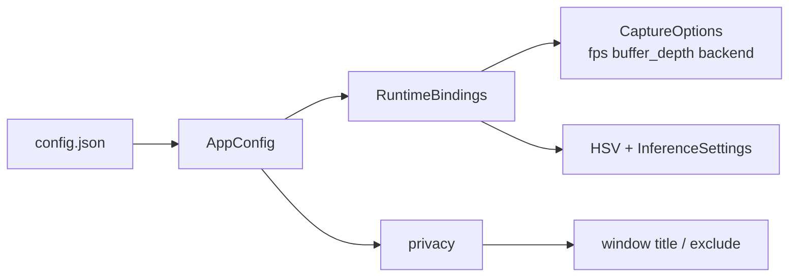

# 설정

기본 파일: 저장소 루트 `config/config.json`  
앱은 리포 루트 기준으로 이 경로를 로드·저장합니다.

보조: `config/hsv_settings.json` (HSV 피커 슬라이더)

> 예전 문서의 `concealment` 블록은 **제거되었습니다.**  
> 현재 스키마는 **`privacy`** 입니다.

## 최상위 구조

```json
{
  "production_system": { },
  "vision_algorithms": { },
  "analytics": { },
  "gui": { },
  "performance": { },
  "compatibility": { },
  "privacy": { }
}
```

## 기본 예시 (현재 트리)

```json
{
  "production_system": {
    "name": "SmartScreenCapture",
    "version": "1.0.0",
    "purpose": "Local screen capture and vision analysis",
    "mode": "production_mode"
  },
  "vision_algorithms": {
    "selected_algorithm": "yolo26",
    "hsv_tracking": {
      "enabled": false,
      "lower_bound": [140, 120, 180],
      "upper_bound": [160, 200, 255],
      "morphology_kernel_size": 3,
      "min_contour_area": 100
    },
    "yolo26_detection": {
      "enabled": false,
      "onnx_model_path": "models/yolo26n.onnx",
      "class_names_path": "models/coco_classes.txt",
      "confidence_threshold": 0.25,
      "max_detections": 100,
      "input_size": [640, 640],
      "execution_providers": ["directml", "openvino", "cpu"],
      "selected_gpu_id": 0,
      "openvino_device_type": null
    }
  },
  "analytics": {
    "enabled": true,
    "max_history_size": 1000,
    "fps_calculation_window_sec": 5.0
  },
  "gui": {
    "show_performance_metrics": true,
    "ui_scale": 1.0,
    "show_metrics_overlay": true
  },
  "performance": {
    "target_fps": 120,
    "enable_multithreading": true,
    "max_processing_threads": 4,
    "frame_buffer_size": 2,
    "enable_gpu_acceleration": true
  },
  "compatibility": {
    "no_hook": true,
    "obs_adapter_allowed": true
  },
  "privacy": {
    "exclude_own_windows_from_capture": false,
    "display_name": "SmartScreenCapture",
    "window_title": "SmartScreenCapture",
    "monitor_title": "SmartScreenCapture Preview"
  }
}
```

## `production_system`

| 필드 | 의미 |
|------|------|
| `name` | 제품/시스템 이름 문자열 |
| `version` | 설정·제품 버전 표기 |
| `purpose` | 용도 설명 |
| `mode` | 예: `production_mode` |

## `vision_algorithms`

| 필드 | 의미 |
|------|------|
| `selected_algorithm` | 예: `"yolo26"` |

### `hsv_tracking`

| 필드 | 의미 |
|------|------|
| `enabled` | HSV 파이프라인 on/off |
| `lower_bound` / `upper_bound` | HSV `[H,S,V]` 범위 |
| `morphology_kernel_size` | morphology 커널 |
| `min_contour_area` | 최소 contour 면적 |

### `yolo26_detection`

| 필드 | 의미 |
|------|------|
| `enabled` | YOLO 추론 on/off |
| `onnx_model_path` | 기본 `models/yolo26n.onnx` |
| `class_names_path` | 기본 `models/coco_classes.txt` |
| `confidence_threshold` | 신뢰도 임계값 |
| `max_detections` | 최대 박스 수 |
| `input_size` | `[W,H]` — 권장 `[640,640]` |
| `execution_providers` | `["directml","openvino","cpu"]` 또는 `"auto"` / 빈 목록 |
| `selected_gpu_id` | DirectML 장치 ID |
| `openvino_device_type` | `null` 또는 `"GPU"`, `"NPU"`, `"GPU.0"` 등 |

`"auto"` 또는 빈 provider 목록 → 기본 순서 DirectML → OpenVINO → CPU.

## `analytics`

| 필드 | 의미 | 비고 |
|------|------|------|
| `enabled` | 분석 스위치 | 일부 필드는 추후 연동 |
| `max_history_size` | 이력 상한 | 미완전 연동 가능 |
| `fps_calculation_window_sec` | FPS 윈도우 | 미완전 연동 가능 |

## `gui`

| 필드 | 의미 | 비고 |
|------|------|------|
| `show_performance_metrics` | 성능 지표 표시 | 사용 |
| `ui_scale` | UI 스케일 | 연동 전이면 무시될 수 있음 |
| `show_metrics_overlay` | 오버레이 | 연동 전이면 무시될 수 있음 |

## `performance`

| 필드 | 의미 |
|------|------|
| `target_fps` | 캡처 목표 FPS |
| `enable_multithreading` | 멀티스레드 의도 플래그 (펌프 연동 전일 수 있음) |
| `max_processing_threads` | 처리 스레드 상한 (연동 전일 수 있음) |
| `frame_buffer_size` | → 런타임 `buffer_depth` (`RuntimeBindings`) |
| `enable_gpu_acceleration` | GPU 가속 의도 |

## `compatibility`

| 필드 | 의미 |
|------|------|
| `no_hook` | 후킹 없는 경로 선호 (현재 DXGI 경로와 일치) |
| `obs_adapter_allowed` | 향후 OBS 어댑터 허용 정책 |

## `privacy` (현재)

운영자 통제 개인정보·표시 문자열. **기본은 투명·감사 가능한 동작**을 선호합니다.

| 필드 | 기본 | 의미 |
|------|------|------|
| `exclude_own_windows_from_capture` | `false` | 자체 창을 데스크톱 캡처에서 제외 (`WDA_EXCLUDEFROMCAPTURE`). 켜면 로그로 알림 |
| `display_name` | SmartScreenCapture | 표시 이름 (비우면 identity 기본값) |
| `window_title` | SmartScreenCapture | 메인 창 제목 |
| `monitor_title` | SmartScreenCapture Preview | 모니터/프리뷰 쪽 제목 |

코드: `capture-first/crates/config` 의 `PrivacyConfig`,  
identity 기본값: `capture_core::identity` (`SmartScreenCapture`).

## 런타임 매핑



UI에서 저장하면 로드한 `config.json` 경로로 다시 씁니다.

## 관련

- [시작하기](시작하기.md) · [모델 가이드](모델-가이드.md) · [파이프라인](파이프라인.md)
