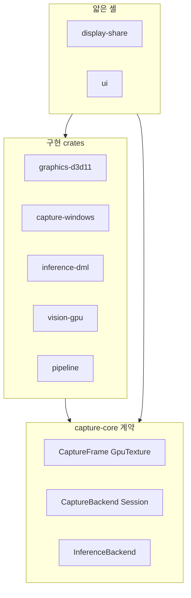
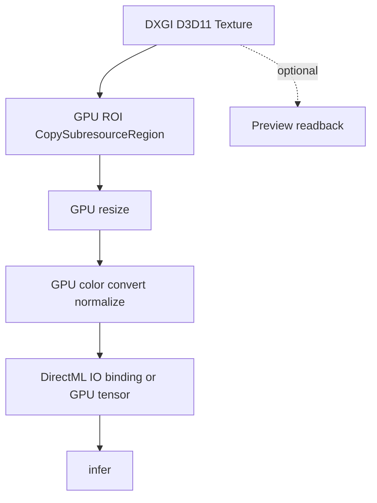
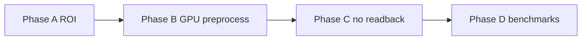
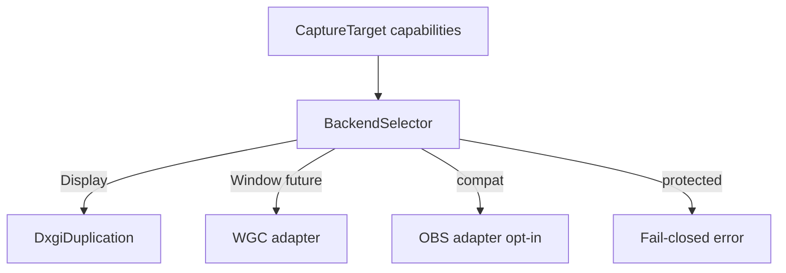
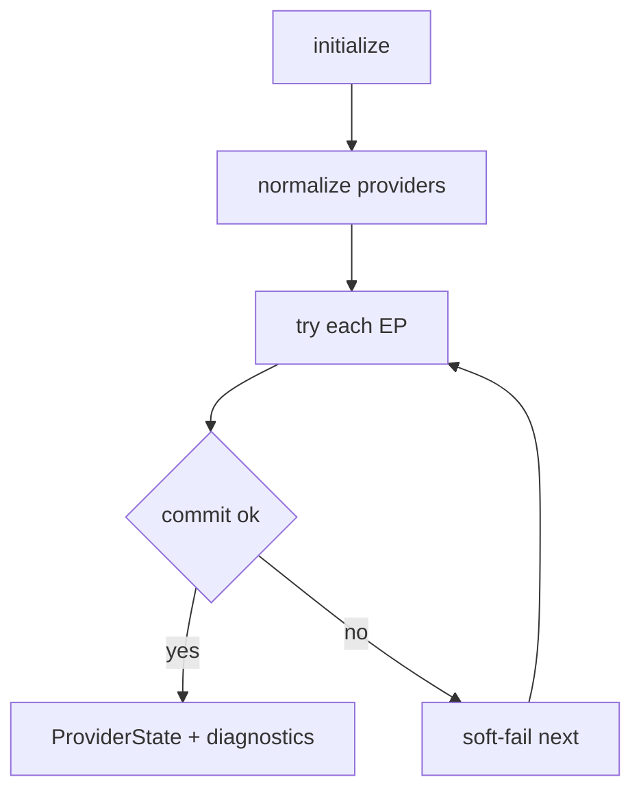
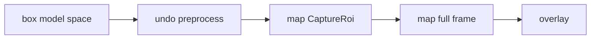
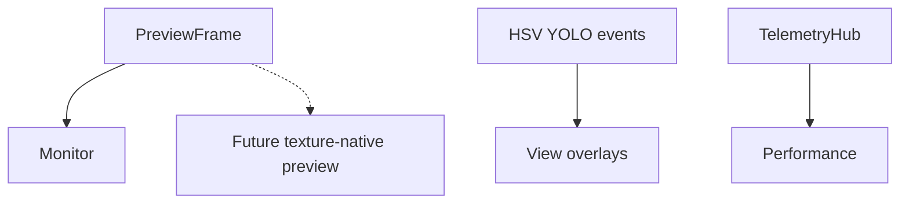
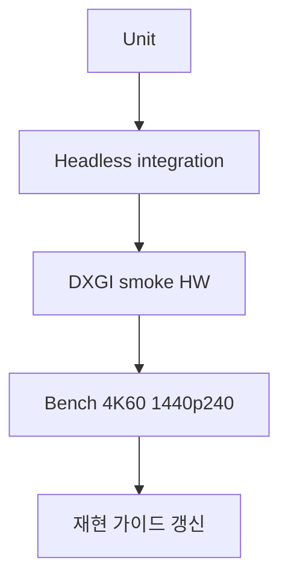

# 설계안

현재 구현을 유지하면서 옮길 **목표 설계(To-Be)** 입니다.  
우선순위: [개선점](개선점.md) · 현재 흐름: [파이프라인](파이프라인.md)

## 1. 설계 목표

| 목표 | 설명 |
|------|------|
| 저지연 | 캡처→검출에서 불필요 CPU 복사 제거 |
| 안전 스레딩 | D3D11 단일 스레드 소유권 유지 |
| 관측 가능성 | backend / provider / drop 을 UI에서 설명 |
| 계약 명확성 | ROI ≠ ModelInput, Preview는 부가 경로 |
| 벤더 중립 추론 | DirectML / OpenVINO / CPU 동일 YOLO 경로 |
| no-hook | 후킹 없는 디스플레이 캡처 |
| 투명 기본값 | privacy 제외 기본 off, 감사 가능 |

## 2. 레이어 원칙 (유지)



1. core에 플랫폼 구현을 되돌리지 않음  
2. 앱 셸에 pipeline god-class 재도입 금지  
3. `as_any` 다운캐스트 웹 재도입 금지  
4. 전처리는 vision/pipeline, 앱은 `infer` 만  

## 3. Zero-copy (Track 2)

### 목표 경로



### 단계

| Phase | 내용 | 완료 기준 |
|-------|------|-----------|
| A | GPU ROI + 선택적 preview | 현재 상당 부분 |
| B | GPU resize + color convert | model input GPU 생성 |
| C | 추론 핫패스 CPU readback 0 | YOLO 경로 `to_cpu_buffer` 없음 |
| D | 벤치 4K60 / 1440p240 | 수치 리포트 |



**권장:** GPU preprocess도 캡처 스레드(또는 동일 디바이스 전용 큐)에서 수행. 비전 워커에 D3D11을 열지 않음.

## 4. 캡처 백엔드

### 현재

```text
Display capture = DXGI Desktop Duplication only
WGC = not implemented (future / fail-closed)
```

### 목표



| 백엔드 | 역할 | 정책 |
|--------|------|------|
| DXGI | 디스플레이 기본 | 현재 구현 |
| WGC | 창/대안 | 미래, 동일 CaptureSession 계약 |
| OBS | 호환 폴백 | `obs_adapter_allowed` 일 때만 |
| Fail-closed | 보호/미지원 | 크래시·훅 없이 에러 |

## 5. 추론



보강 목표:

| 항목 | 설계 |
|------|------|
| 실모델 golden | yolo26n fixture 출력 스냅샷 |
| Live fallback test | EP 실패 순서 보장 |
| 좌표 역매핑 | Model → ROI → Full frame 단일 모듈 |
| IO binding | Track 2 이후 GPU tensor 입력 |



## 6. UI / 관측



운영자가 backend, EP, drop 원인, last inference error 를 UI만으로 이해.

## 7. 설정 스키마

| 영역 | 방향 |
|------|------|
| `RuntimeBindings` | config→runtime SSOT 유지 |
| `privacy` | 투명 기본값 유지, 창 제외 opt-in |
| analytics 미사용 필드 | 연동 또는 deprecated |
| model paths | repo-root 상대 resolve 유지 |

## 8. 검증



성능 수치는 벤치 없이 README에 박지 않음.

## 9. Non-goals

- 커널 훅 / 안티치트 우회 캡처  
- 멀티 GPU 추론 샤딩  
- seg/pose/tracking 일반화 (detect 우선)  
- 크로스 플랫폼 캡처 (Windows-first, core만 중립)  

## 10. 수용 기준

- [ ] 추론 핫패스 CPU readback 제거 + 벤치 개선  
- [ ] ROI↔Model 좌표 변환 단일 모듈 + 테스트  
- [ ] 보호 콘텐츠 fail-closed 메시지  
- [ ] 실 onnx golden test  
- [ ] UI provider fallback 사유 표시  

다음: [개선점](개선점.md)
