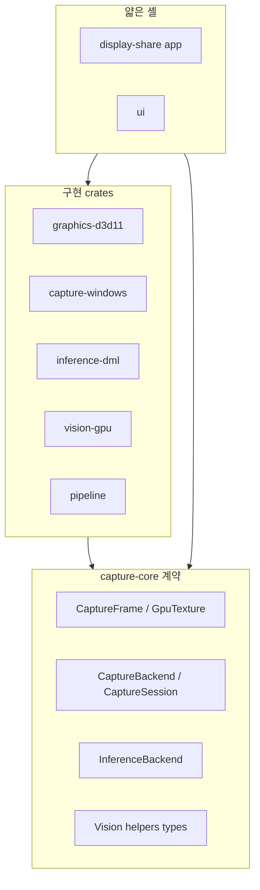
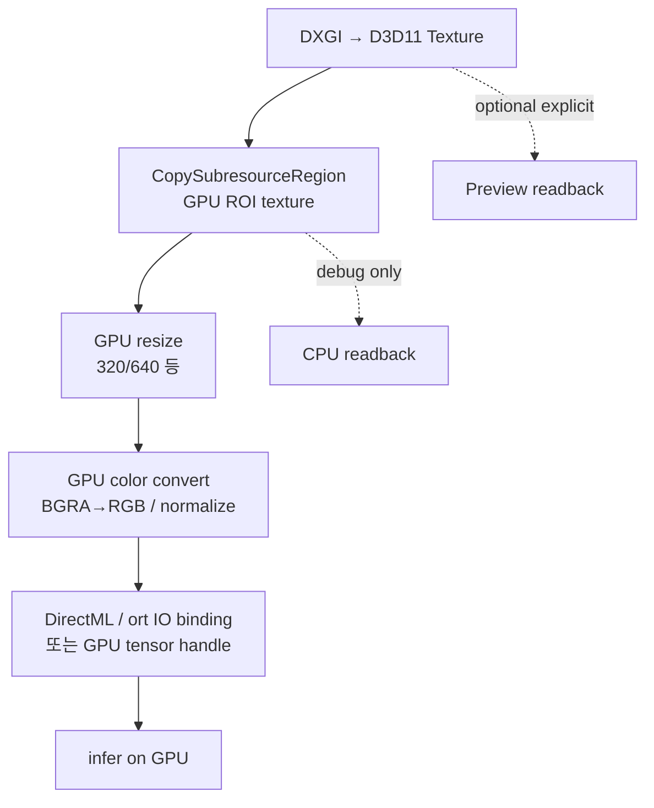
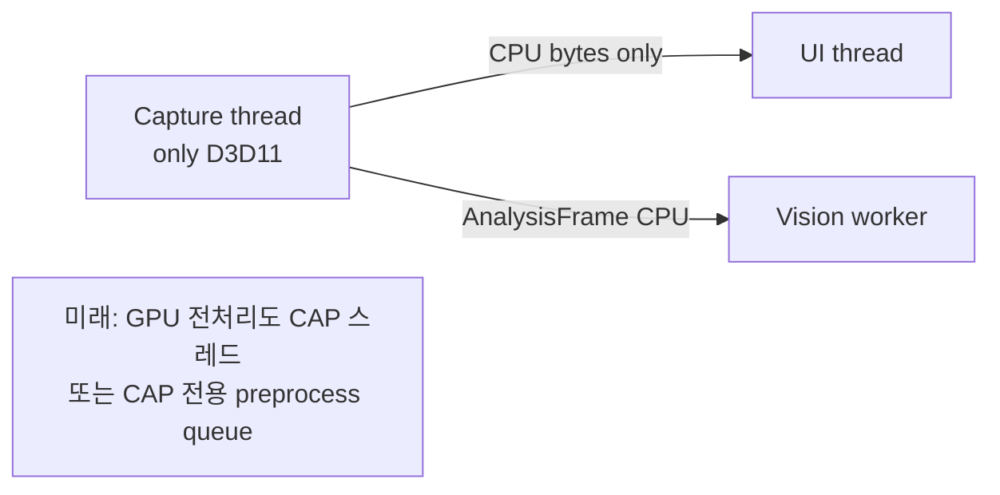
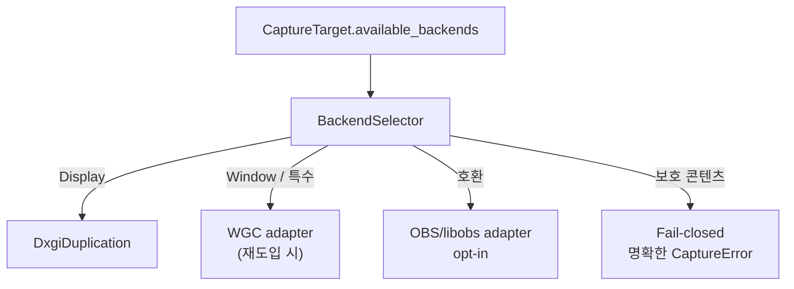
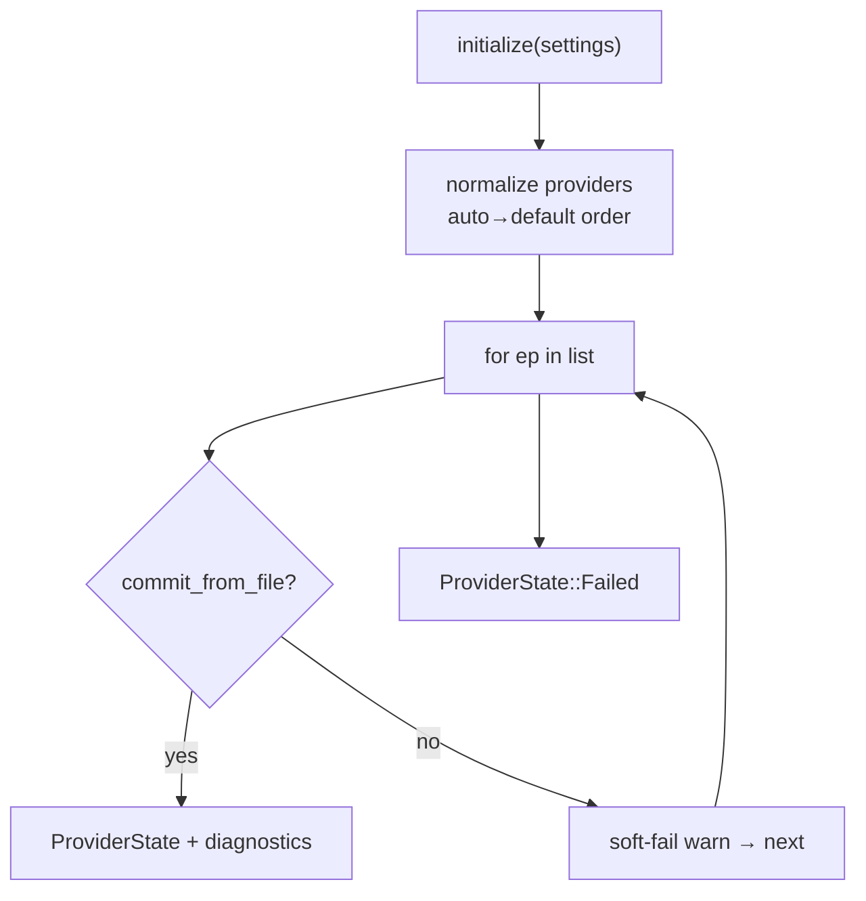
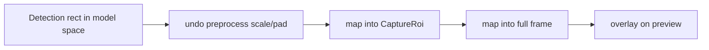
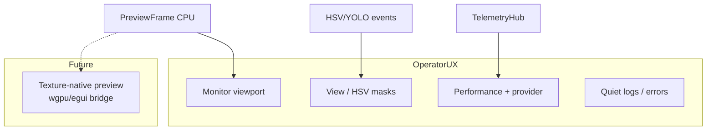
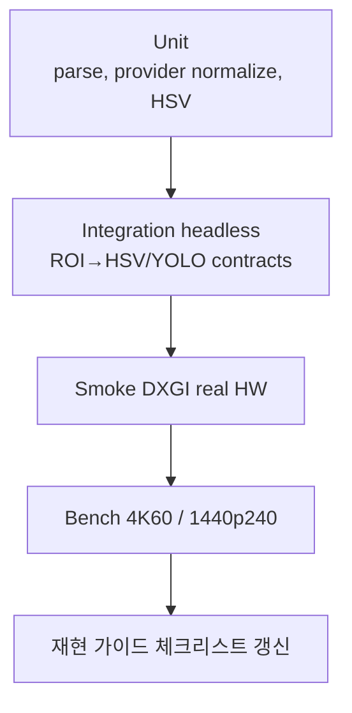

# 설계안

현재 구현(As-Is)을 유지하면서 **다음 단계로 옮길 목표 설계(To-Be)** 를 정리합니다.  
실행 우선순위는 [개선점](개선점.md), 프레임 흐름은 [파이프라인](파이프라인.md)을 참고하세요.

## 1. 설계 목표

| 목표 | 설명 |
|------|------|
| 저지연 | 캡처→검출 경로에서 불필요한 CPU 복사 제거 |
| 안전 스레딩 | D3D11 단일 스레드 소유권 유지 |
| 관측 가능성 | backend / provider / drop 원인을 UI에서 설명 가능 |
| 계약 명확성 | ROI ≠ ModelInput, Preview는 부가 경로 |
| 벤더 중립 추론 | DirectML / OpenVINO / CPU 동일 YOLO 경로 |
| no-hook | 후킹 없는 디스플레이 캡처 (호환 어댑터는 명시적 opt-in) |

## 2. 레이어 원칙 (유지)



**원칙**

1. `capture-core` 에 플랫폼 구현을 다시 넣지 않는다.
2. 앱 셸에 pipeline/god-class 로직을 되돌리지 않는다 (`pipeline` 유지).
3. `as_any` 다운캐스트 웹을 재도입하지 않는다 (`CaptureFrame` enum + trait).
4. 전처리는 vision/pipeline 소유, 앱은 `infer` 만 호출.

## 3. 목표 파이프라인 설계 (Zero-Copy Track 2)

### 3.1 목표 데이터 경로



### 3.2 단계적 이행

```mermaid
gantt
  title Zero-copy 이행 단계 (논리 순서)
  dateFormat X
  axisFormat %s

  section Phase A
  GPU ROI crop 유지/강화           :a1, 0, 1
  Preview readback 명시적 유지     :a2, 0, 1

  section Phase B
  GPU resize shader/pass           :b1, 1, 2
  BGRA→model layout convert        :b2, 1, 2

  section Phase C
  추론 핫패스 CPU readback 제거    :c1, 2, 3
  IO binding / GPU tensor          :c2, 2, 3

  section Phase D
  벤치 4K60 / 1440p240             :d1, 3, 4
  회귀 테스트 확장                 :d2, 3, 4
```



| Phase | 완료 기준 |
|-------|-----------|
| A | ROI GPU crop + 선택적 preview (현재 상당 부분 충족) |
| B | model input 크기까지 GPU에서 생성 가능 |
| C | YOLO 핫패스에서 `to_cpu_buffer` 호출 0 |
| D | 수치화된 지연/드롭 리포트 |

### 3.3 스레딩 설계 (변경 없음 · 강화)



**권장:** GPU resize/convert 도 **캡처 스레드(또는 그와 디바이스를 공유하는 전용 GPU 큐)** 에서 수행하고, 워커에는 최종 tensor 메타/CPU fallback 만 전달.  
비전 워커에 D3D11을 열지 않는 제약은 유지한다.

## 4. 캡처 백엔드 설계

### 4.1 현재

```text
Preference(WGC|DXGI|Auto) → resolve → 항상 DXGI Duplication (가능 시)
```

### 4.2 목표



| 백엔드 | 역할 | 정책 |
|--------|------|------|
| DXGI | 디스플레이 기본 | no-hook, 고성능 |
| WGC | 창/대안 경로 | 필요할 때만, 계약은 동일 `CaptureSession` |
| OBS adapter | 호환 폴백 | `compatibility.obs_adapter_allowed` 가 true 일 때만 |
| Fail-closed | 보호/미지원 | 크래시·훅 없이 에러 |

## 5. 추론 설계

### 5.1 Provider 정책 (유지·강화)



### 5.2 목표 보강

| 항목 | 설계 |
|------|------|
| 실모델 검증 | `yolo26n.onnx` fixture 로 output shape golden test |
| Live fallback 테스트 | mock EP 실패 주입 또는 통합 테스트 환경 |
| IO binding | DirectML 경로에서 GPU tensor 직접 입력 |
| 좌표 역매핑 | ModelInput → CaptureRoi → Full frame 변환 유틸 단일화 |



## 6. UI / 관측 설계



목표: 운영자가 **백엔드 선택, EP, drop 원인, last inference error** 를 UI만으로 이해.

## 7. 설정 · 스키마 설계

| 영역 | 방향 |
|------|------|
| `RuntimeBindings` | 이미 config→runtime 매핑의 SSOT — 유지 |
| 미사용 analytics 필드 | 연동 또는 deprecated 주석 정리 |
| model paths | repo-root 상대 경로 resolve 유지 |
| concealment | 기본 on, 제품 문자열과 캡처 제외 분리 테스트 |

## 8. 검증 설계



성능 클레임은 **벤치 리포트 없이 README에 수치를 박지 않는다**.

## 9. 비목표 (Non-goals)

- 커널 훅 / 안티치트 우회 계열 캡처
- 다중 GPU 추론 샤딩
- segmentation/pose/tracking 헤드 일반화 (detect 계약 우선)
- 크로스 플랫폼 캡처 (Windows-first 유지, core 계약만 중립)

## 10. 결정 체크리스트 (설계 수용 기준)

- [ ] 추론 핫패스 CPU readback 제거 PR 이 벤치에서 지연 개선을 보여 줌
- [ ] ROI↔ModelInput 좌표 변환 단일 모듈 + 테스트
- [ ] 보호 콘텐츠 fail-closed 메시지 고정
- [ ] 실 onnx golden output 테스트 CI/로컬 문서화
- [ ] UI에서 provider fallback 사유 표시

다음: 갭과 우선순위는 [개선점](개선점.md).
