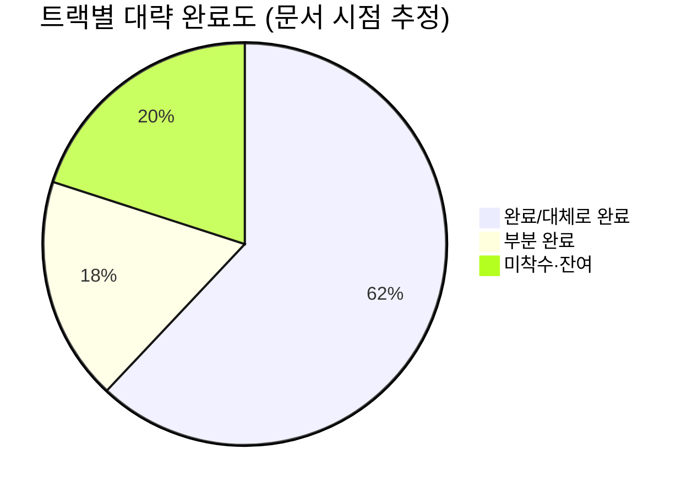
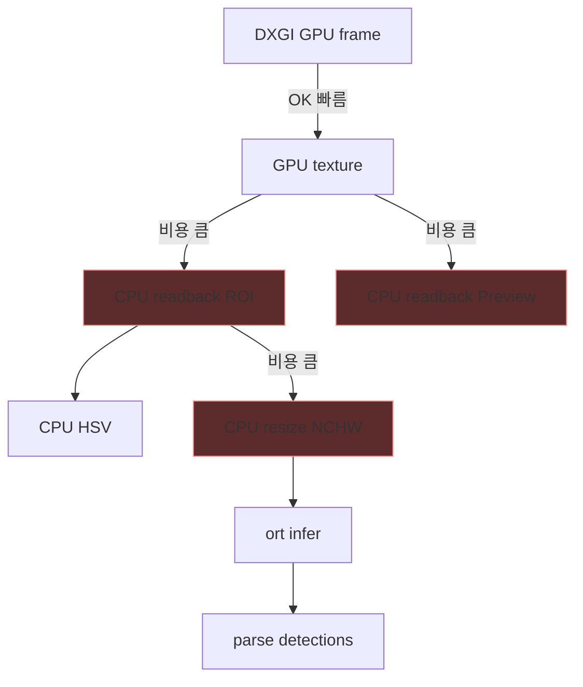
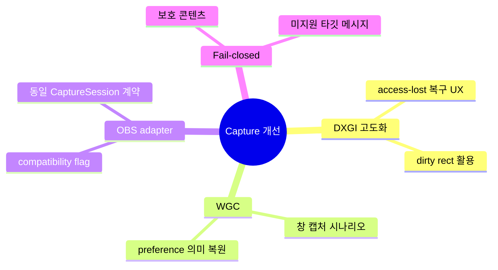
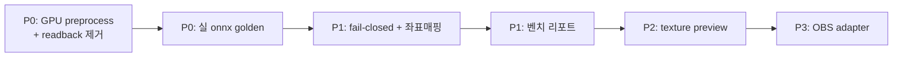
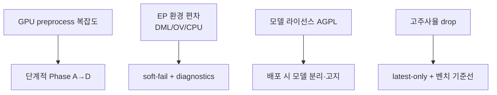

# 개선점

As-Is 대비 갭, 병목, 우선순위를 정리합니다.  
원 백로그: `main` 의 [`MIGRATION_TASKS.md`](https://github.com/NAMUORI00/display-share/blob/main/capture-first/MIGRATION_TASKS.md)

## 1. 현황 스냅샷

| 트랙 | 상태 | 핵심 잔여 |
|------|------|-----------|
| 0 Design refactor | 완료 | 회귀 방지 |
| 1 Capture backends | 부분 | OBS adapter, fail-closed, WGC 실사용 재정렬 |
| 2 Zero-copy vision | **핵심 잔여** | GPU resize/convert, 추론 경로 readback 제거 |
| 3 Inference | 부분 | 실 onnx 검증, live fallback 테스트 |
| 4 UI | 부분 | texture-native preview |
| 5 Verification | 부분 | 실기 스모크, 4K60/1440p240 벤치 |

## 2. 병목 맵 (현재 핫패스)

| 병목 | 증상 | 개선 방향 |
|------|------|-----------|
| ROI CPU readback | 고해상도·고주사율에서 분석 FPS 하락 | Track 2 GPU preprocess |
| Preview readback | 모니터 뷰 on 시 캡처 스레드 부하 | 해상도/주기 throttle, 이후 texture path |
| CPU NCHW preprocess | YOLO on 시 처리 ms 증가 | GPU resize+normalize |
| 워커 큐 full | analysis drop | 배압 정책·우선순위, 처리 단축 |
| 모델 cold start | 첫 검출 지연 | 사전 로드 UX, EP 실패 사유 표시 |

## 3. 트랙별 개선 항목

### Track 1 — Capture

| 항목 | 우선순위 | 메모 |
|------|----------|------|
| 보호/미지원 fail-closed | P1 | 크래시 없이 운영자 메시지 |
| access-lost 재초기화 경로 점검 | P1 | 이미 일부 코드/테스트 존재 — UX 연결 |
| OBS/libobs adapter | P3 | 호환 필요할 때만 |
| WGC 실제 경로 | P2 | 문서/코드 “DXGI-only” 와 백로그 표현 정렬 필요 |

### Track 2 — Zero-copy (최고 우선)

| 항목 | 우선순위 | 완료 정의 |
|------|----------|-----------|
| GPU resize | P0 | ROI→model size GPU 출력 |
| GPU color convert + normalize | P0 | BGRA→모델 입력 레이아웃 |
| 추론 핫패스 readback 제거 | P0 | YOLO 경로 `to_cpu_buffer` 0 |
| 셰이더/패스 320 & 640 | P1 | 입력 크기 설정 가능 |
| Preview optional 유지 | P1 | 이미 상당 부분 — 정책 문서화·테스트 |

### Track 3 — Inference

| 항목 | 우선순위 | 완료 정의 |
|------|----------|-----------|
| yolo26n 실출력 golden test | P0 | 고정 입력 이미지→박스 스냅샷 |
| live provider fallback 테스트 | P1 | EP 실패 시 순서 보장 |
| 좌표 역매핑 단일화 | P1 | UI 오버레이 정확도 |
| IO binding | P2 | Track 2 이후 |

### Track 4 — UI

| 항목 | 우선순위 | 완료 정의 |
|------|----------|-----------|
| texture-native preview | P2 | CPU ColorImage 업로드 제거 |
| provider fallback 사유 노출 | P1 | diagnostics → UI 문구 |
| drop/fps 설명 툴팁 | P2 | 운영자 교육 비용 감소 |

### Track 5 — Verification

| 항목 | 우선순위 | 완료 정의 |
|------|----------|-----------|
| Win11 실기 스모크 체크리스트 실행 기록 | P0 | [재현 가이드](재현-가이드.md) 결과 템플릿 |
| 4K60 벤치 | P1 | 지연/드롭 표 |
| 1440p240 안정성 | P1 | 장시간 drop 곡선 |

## 4. 우선순위 로드맵

권장 실행 순서 (백로그와 동일 취지):

1. ROI resize·preprocess 를 D3D11으로 이동  
2. 추론 경로 CPU readback 제거 (preview는 선택 유지)  
3. 실제 모델 출력 파싱 하드닝 + golden test  
4. fail-closed · 좌표 매핑  
5. 실기 스모크 · 벤치  

## 5. 기술 부채 · 문서 부채

| 부채 | 영향 | 조치 |
|------|------|------|
| README/백로그의 WGC 서술 vs DXGI-only 구현 | 기여자 혼란 | 코드/문서 중 하나로 SSOT 정렬 |
| analytics 필드 미연동 | 설정 허위 기대 | 연동 또는 deprecated |
| onnx gitignore | 재현 시 추가 스텝 | 다운로드 스크립트·위키 유지 (현재 적절) |
| 성능 수치 부재 | 마케팅/이슈 논쟁 | 벤치 전 수치 주장 금지 |
| 로컬 폴더명 `C_capture` vs 원격 `display-share` | 온보딩 혼선 | README에 이력명 명시 (완료) |

## 6. 리스크

## 7. 완료 정의 (프로그램 레벨)

다음이 모두 참이면 “제로카피 비전 파이프라인 MVP 완료”로 본다.

- [ ] 캡처→ROI→model input 이 GPU에서 연결
- [ ] YOLO 핫패스 CPU readback 없음
- [ ] preview/debug readback 만 명시적 옵션
- [ ] yolo26n golden test 통과
- [ ] Win11 + 최소 1개 GPU 벤치 표가 위키/이슈에 존재
- [ ] UI에서 backend·provider·fallback·drop 설명 가능

## 8. 관련 문서

- [설계안](설계안.md) — To-Be 구조
- [파이프라인](파이프라인.md) — As-Is 프레임 흐름
- [아키텍처](아키텍처.md) — 크레이트·스레드
- [개발 현황](개발-현황.md) — 체크리스트 요약
