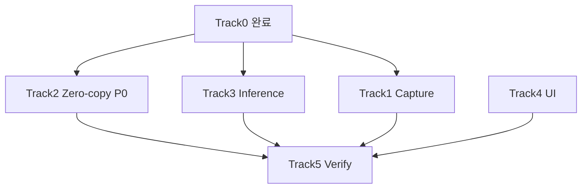
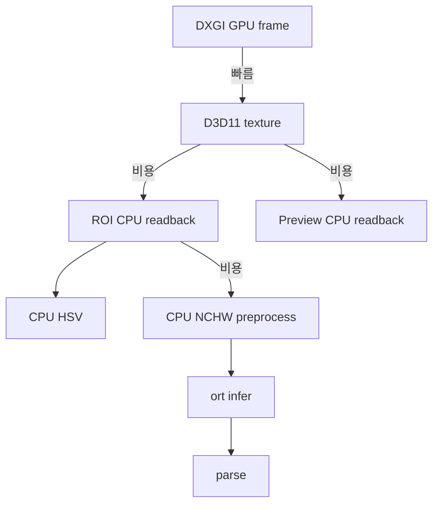
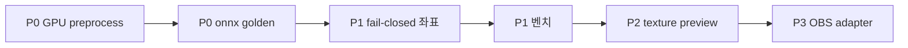
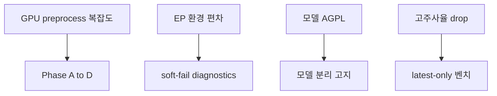

# 개선점

As-Is 갭·병목·우선순위.  
원 백로그: [`MIGRATION_TASKS.md`](https://github.com/NAMUORI00/display-share/blob/main/capture-first/MIGRATION_TASKS.md)

## 1. 트랙 스냅샷

| 트랙 | 상태 | 핵심 잔여 |
|------|------|-----------|
| 0 Design refactor | 완료 | 회귀 방지 |
| 1 Capture | 부분 | WGC 미래, OBS, fail-closed |
| 2 Zero-copy | **핵심 잔여** | GPU resize/convert, 추론 readback 제거 |
| 3 Inference | 부분 | 실 onnx golden, live fallback test |
| 4 UI | 부분 | texture-native preview |
| 5 Verification | 부분 | 실기 스모크, 4K60/1440p240 |

## 2. 현재 핫패스 병목

| 병목 | 증상 | 방향 |
|------|------|------|
| ROI CPU readback | 고해상도·고주사율 분석 FPS 하락 | Track 2 GPU preprocess |
| Preview readback | 모니터 on 시 캡처 스레드 부하 | throttle / texture path |
| CPU NCHW | YOLO on 시 processing ms 증가 | GPU resize+normalize |
| 워커 큐 full | analysis drop | 처리 단축·배압 |
| 모델 cold start | 첫 검출 지연 | 사전 로드 UX |

## 3. Track 1 Capture

| 항목 | 우선순위 | 메모 |
|------|----------|------|
| 보호/미지원 fail-closed | P1 | 크래시 없이 메시지 |
| access-lost 재초기화 UX | P1 | 코드/테스트 일부 존재 |
| WGC 실제 경로 | P2 | 현재 DXGI-only, 백로그 future |
| OBS/libobs adapter | P3 | compatibility flag |

문서·코드 SSOT: **지금은 DXGI only**. “WGC 구현됨” 표기는 금지.

## 4. Track 2 Zero-copy (P0)

| 항목 | 우선순위 | 완료 정의 |
|------|----------|-----------|
| GPU resize | P0 | ROI→model size GPU |
| GPU color convert | P0 | BGRA→모델 레이아웃 |
| 추론 핫패스 readback 제거 | P0 | YOLO `to_cpu_buffer` 0 |
| 320/640 shader path | P1 | 입력 크기 설정 |
| Preview optional 유지 | P1 | 테스트·문서화 |

## 5. Track 3 Inference

| 항목 | 우선순위 | 완료 정의 |
|------|----------|-----------|
| yolo26n golden test | P0 | 고정 입력→박스 스냅샷 |
| live provider fallback | P1 | EP 실패 순서 |
| 좌표 역매핑 단일화 | P1 | 오버레이 정확도 |
| IO binding | P2 | Track 2 이후 |

## 6. Track 4 UI

| 항목 | 우선순위 | 완료 정의 |
|------|----------|-----------|
| provider fallback 사유 UI | P1 | diagnostics 문구 |
| texture-native preview | P2 | CPU ColorImage 제거 |
| drop/fps 툴팁 | P2 | 운영자 이해 |

## 7. Track 5 Verification

| 항목 | 우선순위 | 완료 정의 |
|------|----------|-----------|
| Win11 실기 스모크 기록 | P0 | [재현 가이드](재현-가이드.md) 템플릿 |
| 4K60 벤치 | P1 | 지연/드롭 표 |
| 1440p240 안정성 | P1 | 장시간 drop |

## 8. 로드맵

1. ROI resize·preprocess → D3D11  
2. 추론 경로 CPU readback 제거  
3. 실모델 파싱 하드닝 + golden  
4. fail-closed · 좌표 매핑  
5. 실기 스모크 · 벤치  

## 9. 문서·기술 부채

| 부채 | 조치 |
|------|------|
| 예전 concealment 문서 | **privacy 로 교체** (이 위키) |
| WGC “구현됨” 오해 | DXGI-only 명시 |
| analytics 미연동 필드 | 연동 또는 deprecated |
| onnx gitignore | 다운로드 스크립트 유지 |
| 성능 수치 부재 | 벤치 전 수치 주장 금지 |
| 로컬 폴더명 C_capture | README에 이력명 고지 |

## 10. 리스크

## 11. 프로그램 완료 정의 (제로카피 MVP)

- [ ] 캡처→ROI→model input GPU 연결  
- [ ] YOLO 핫패스 CPU readback 없음  
- [ ] preview/debug readback 만 옵션  
- [ ] yolo26n golden 통과  
- [ ] Win11 + GPU 벤치 표 존재  
- [ ] UI에서 backend·provider·fallback·drop 설명 가능  

## 관련

- [설계안](설계안.md) · [파이프라인](파이프라인.md) · [아키텍처](아키텍처.md) · [개발 현황](개발-현황.md)
