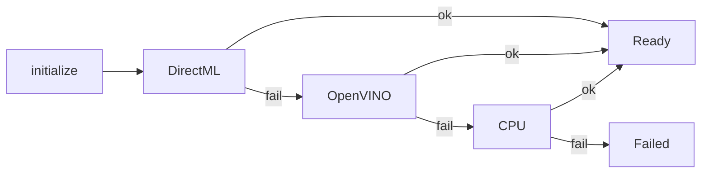

# 모델 가이드

YOLO26 **detect** ONNX 준비와 런타임 연동입니다.

## 지원 범위

| 항목 | 값 |
|------|-----|
| 모델 | YOLO26 detect |
| 입력 | 640×640 권장 |
| 배치 | `batch=1` |
| EP 순서 | DirectML → OpenVINO → CPU |

**포함하지 않음:** segmentation / pose / tracking head.

## 파일 배치

```text
models/
├── README.md
├── yolo26n.onnx      # gitignore — 로컬 다운로드
└── coco_classes.txt  # 저장소 추적
```

설정 기본값:

- `onnx_model_path`: `models/yolo26n.onnx`
- `class_names_path`: `models/coco_classes.txt`

## 다운로드 (권장)

저장소 루트:

```powershell
.\scripts\download_yolo26n.ps1
```

URL (Ultralytics assets v8.4.0):

```text
https://github.com/ultralytics/assets/releases/download/v8.4.0/yolo26n.onnx
```

## 로컬 export

```bash
pip install ultralytics
yolo export model=yolo26n.pt format=onnx imgsz=640 batch=1 dynamic=False
```

입력 크기·배치·출력 레이아웃이 달라지면 런타임이 거부할 수 있습니다.  
프로젝트에서 검증한 계약 하나만 유지하세요.

## GPU / NPU



| 정책 | 내용 |
|------|------|
| 디바이스 | 앱당 하나 (`selected_gpu_id` / OpenVINO `device_type`) |
| soft-fail | EP 실패 시 다음 provider, panic 없음 |
| 분산 | 멀티 GPU 추론 샤딩 없음 |
| OpenVINO | Runtime 미설치 시 해당 EP 스킵 |

## 클래스 파일

`coco_classes.txt` 는 모델 학습 클래스 순서와 같아야 합니다 (COCO 80 클래스 일반).  
누락 시 초기화/표시 단계에서 오류가 날 수 있습니다.

## 문제 해결

| 증상 | 확인 |
|------|------|
| 모델 초기화 실패 | 경로, 640/batch1 계약, ort/DirectML |
| GPU 미선택 | `selected_gpu_id`, OpenVINO device_type, UI provider 상태 |
| 클래스 오류 | `coco_classes.txt` 존재·순서 |

## 라이선스

YOLO26 / Ultralytics 가중치·ONNX는 **별도 라이선스**(AGPL-3.0 또는 상업 라이선스 등)일 수 있습니다.  
앱 소스 MIT와 별개입니다. → [라이선스](라이선스.md)

## 관련

- [설정](설정.md) · [시작하기](시작하기.md) · [파이프라인](파이프라인.md)
