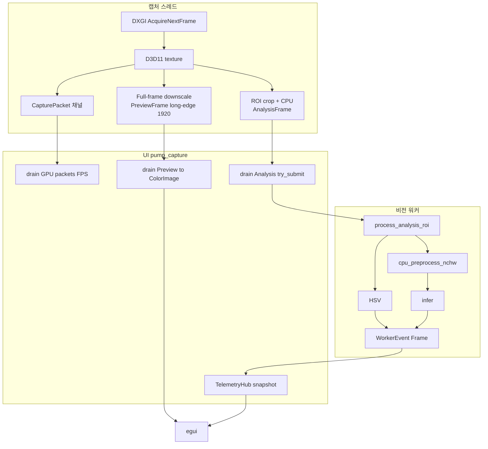
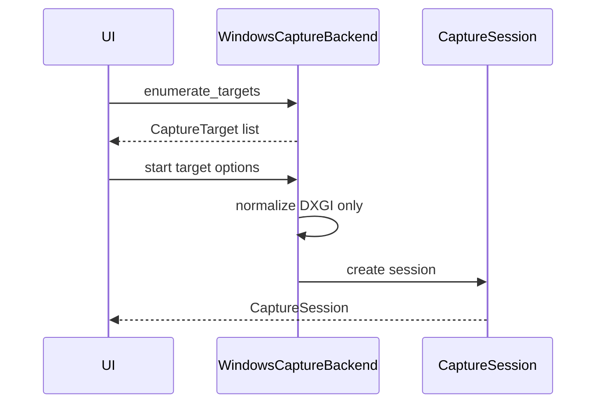
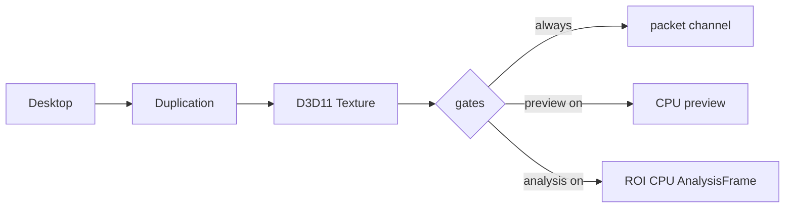
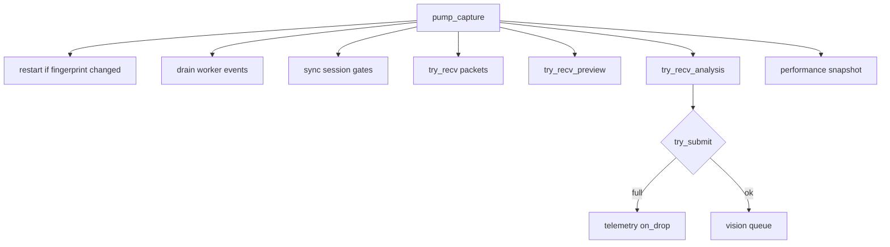
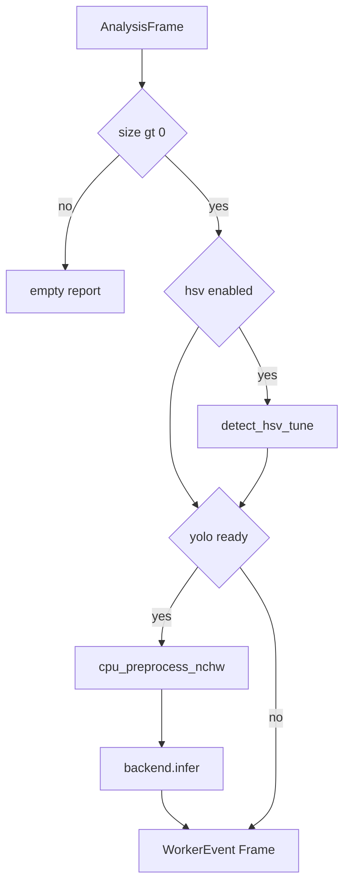
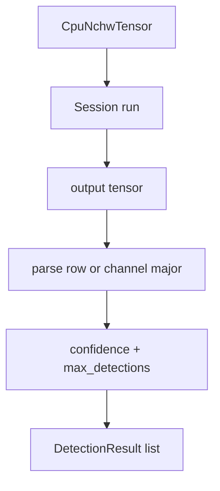
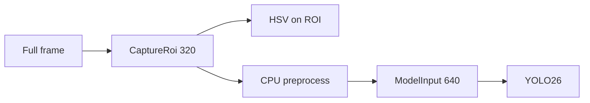
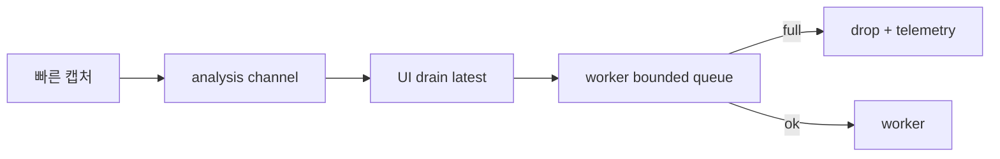

# 파이프라인

캡처 → 분석 → 추론 → UI 반영 **프레임 단위 전체 흐름** (현재 구현 기준).

## 1. 엔드투엔드



## 2. Stage 0 — 세션 기동

| 단계 | 위치 | 동작 |
|------|------|------|
| 0.1 | UI | `enumerate_targets` (DXGI outputs) |
| 0.2 | UI | `CaptureOptions` (fps, buffer_depth, preference) |
| 0.3 | capture-windows | normalize + resolve → **DXGI** |
| 0.4 | capture-windows | SharedD3d11Device + Duplication 세션 |
| 0.5 | UI | SessionFingerprint (옵션 변경 시 재시작) |
| 0.6 | UI | `privacy.exclude_own_windows` 가 true 면 창 제외 적용·로그 |



## 3. Stage 1 — 캡처 핫패스



| 계약 | 값 |
|------|-----|
| Capture ROI 기본 | center max **320×320** (`pipeline::DEFAULT_CAPTURE_ROI`) |
| Preview long-edge (캡처) | **1920** (`dxgi.rs`) |
| 프레임 정책 | 최신 우선, 중간 프레임 skip/drop 집계 |

## 4. Stage 2 — UI 펌프



중요: GPU packet 은 워커에 넣지 않음. Analysis 만.

## 5. Stage 3 — 비전 워커

`FramePipeline::process_analysis_roi` — **D3D11 비접촉**



워커는 항상:

```text
settings.want_preview_buffer = false
settings.preview_enabled = false
```

## 6. Stage 4 — 추론



## 7. Stage 5 — UI 반영

| 입력 | 효과 |
|------|------|
| PreviewFrame | 모니터 ColorImage |
| WorkerEvent::Frame | HSV 오버레이, YOLO 박스, ms, provider |
| ModelReady | provider + diagnostics |
| Failed | last_error / 로그 |
| Telemetry | FPS, drop |

## 8. ROI vs Model Input



이 분리가 깨지면 좌표 매핑·성능 측정이 틀어집니다.

## 9. 배압



## 10. 오류

| 원인 | 전파 |
|------|------|
| DXGI access lost | session error → UI disconnect |
| Model init fail | Failed 이벤트 또는 EP soft-fail |
| Infer/parse fail | last_error + diagnostics |
| Missing onnx | autoload skip / 메시지 |

## 관련

- [아키텍처](아키텍처.md) · [설계안](설계안.md) · [설정](설정.md)
