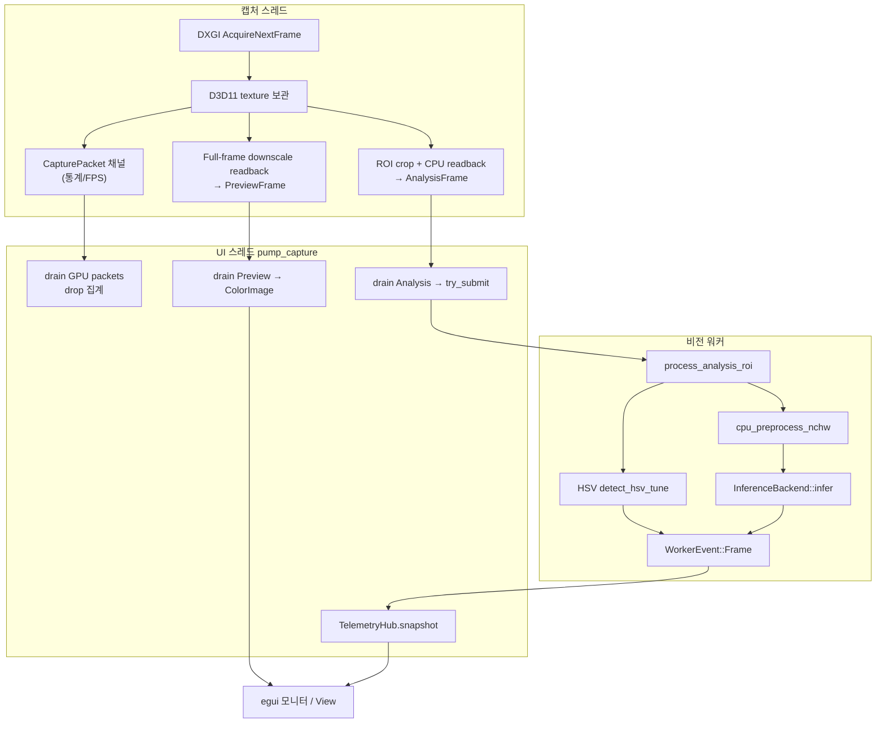
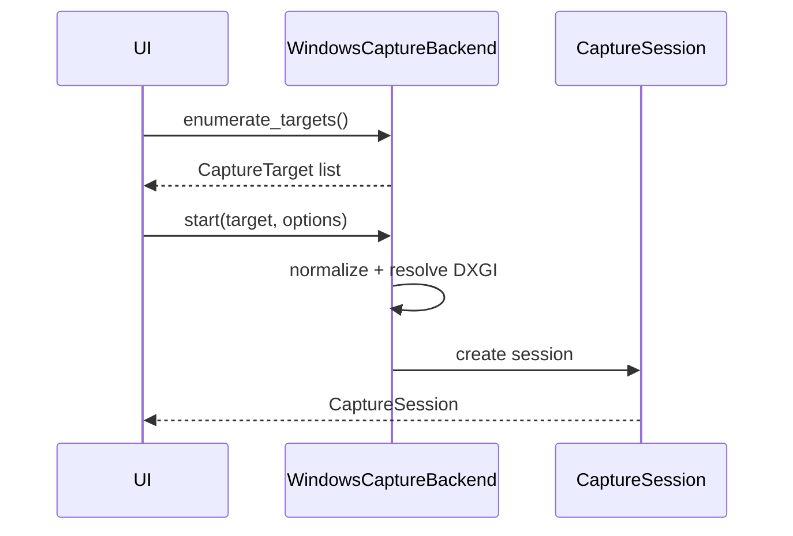
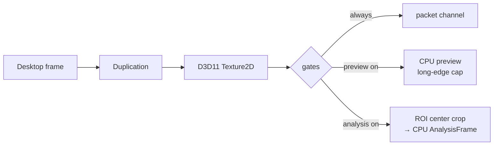
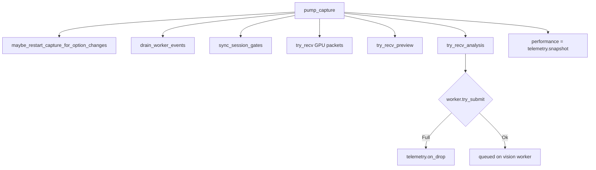
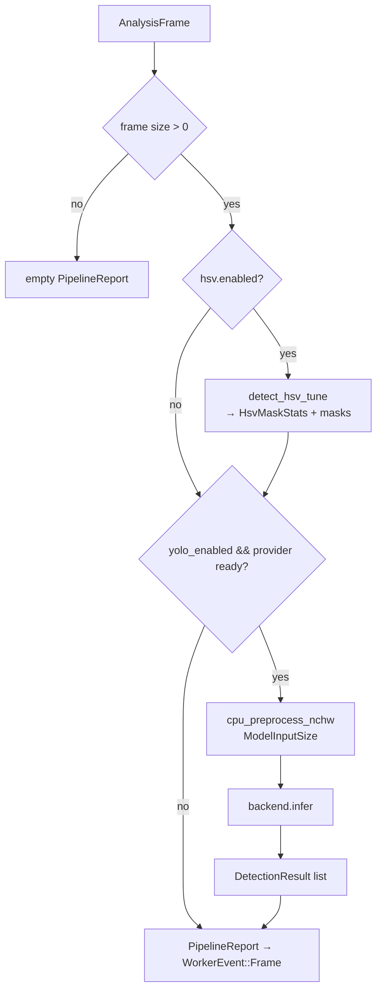
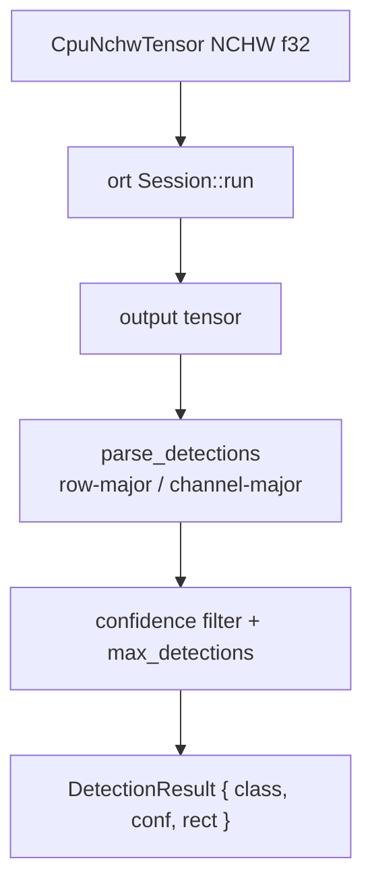
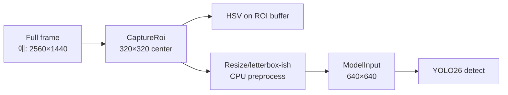
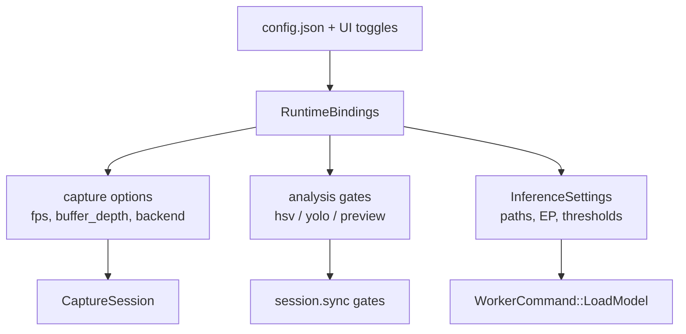
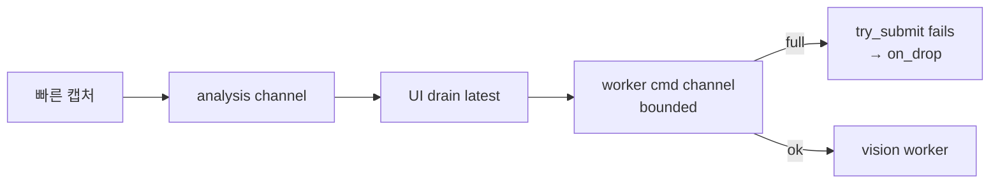
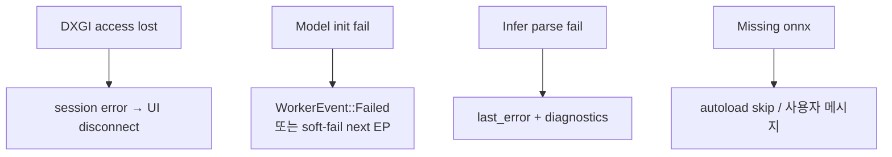

# 파이프라인

캡처 → 분석 → 추론 → UI 반영까지 **프레임 단위 전체 파이프라인**입니다.

## 1. 엔드투엔드 개요



## 2. 단계별 상세

### Stage 0 — 세션 기동

| 단계 | 위치 | 동작 |
|------|------|------|
| 0.1 | UI | 대상 열거 `enumerate_targets` |
| 0.2 | UI | `CaptureOptions` 구성 (fps, buffer_depth, backend preference, concealment) |
| 0.3 | capture-windows | `normalize_for_display_capture` + `resolve_backend` → DXGI |
| 0.4 | capture-windows | `SharedD3d11Device` + Desktop Duplication 세션 시작 |
| 0.5 | UI | `SessionFingerprint` 저장 (옵션 변경 시 재시작) |



### Stage 1 — 캡처 핫패스



**정책**

- ROI 기본 계약: center crop, max **320×320** (`pipeline::DEFAULT_CAPTURE_ROI`)
- Preview long-edge: 캡처 쪽 구현과 UI 정책에 따라 제한 (파이프라인 상수 `PREVIEW_MAX_LONG_EDGE` 등은 경로별로 적용)
- 최신 프레임 우선: UI는 채널을 drain 하며 중간 프레임은 skip/drop 으로 집계

### Stage 2 — UI 펌프 (`pump_capture`)



중요: GPU packet 은 **워커에 제출하지 않는다**. 분석은 Analysis 채널만.

### Stage 3 — 비전 워커 처리

`FramePipeline::process_analysis_roi` (D3D11 비접촉)



워커는 항상:

```text
settings.want_preview_buffer = false
settings.preview_enabled = false
```

미리보기는 캡처 스레드 전용.

### Stage 4 — 추론 내부



### Stage 5 — UI 반영

| 이벤트 | UI 효과 |
|--------|---------|
| PreviewFrame | 모니터 뷰포트 `ColorImage` |
| WorkerEvent::Frame | HSV 오버레이, YOLO 박스, processing_ms, provider |
| WorkerEvent::ModelReady | provider_state + diagnostics 요약 |
| WorkerEvent::Failed | last_error / 로그 |
| Telemetry snapshot | FPS, drop 표시 |

## 3. 이중 해상도 계약 (ROI vs Model Input)



| 개념 | 기본값 | 소유 |
|------|--------|------|
| Capture ROI | 320×320 | 운영자 관심 영역 |
| Model input | 640×640 | 모델 export 계약 |
| Preview | long-edge 제한 | 운영자 UX 전용 |

이 분리가 깨지면 좌표 매핑·성능 측정이 모두 틀어진다. `pipeline` 이 둘을 명시적으로 구분한다.

## 4. 제어 평면 (설정 토글)



| 토글 | 파이프라인 영향 |
|------|----------------|
| HSV off | ROI 분석 부담 감소, 오버레이 클리어 |
| YOLO off | infer 스킵, 모델 로드 불필요 가능 |
| Preview off | 캡처 스레드 full-frame readback 감소 |
| concealment | 창 제목, quiet log, WDA 제외 |

## 5. 배압 · 드롭 정책



- 최신 프레임 우선 (중간 프레임 스킵 허용)
- 워커 큐 full 이면 분석 프레임 드롭 — 캡처는 계속
- 텔레메트리가 drop/fps 를 UI에 노출

## 6. 오류 전파



## 7. 헤드리스 테스트 경로

`pipeline` / `vision-gpu` 단위 테스트는 실 DXGI 없이:

```text
합성/파일 CPU 버퍼 → ROI/HSV/preprocess 계약 검증
```

실기 smoke: `capture-windows` 의 DXGI 프레임 수신 테스트 (GPU/디스플레이 의존).

## 8. 관련 문서

- [아키텍처](아키텍처.md) — 크레이트·스레드 경계
- [설계안](설계안.md) — GPU 전처리·제로카피 목표 설계
- [개선점](개선점.md) — 현재 병목과 트랙별 갭
- [설정](설정.md) · [모델 가이드](모델-가이드.md)
