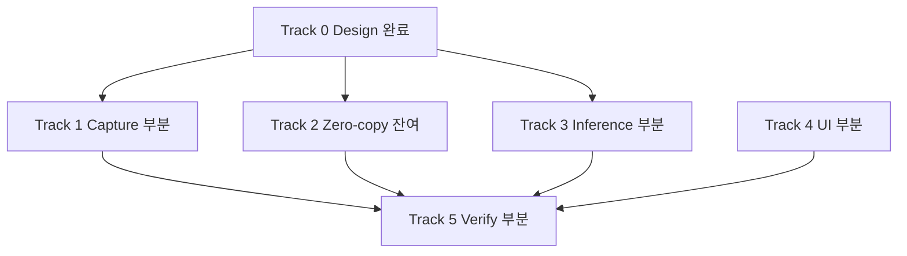

# 개발 현황

`main` 의 [`capture-first/MIGRATION_TASKS.md`](https://github.com/NAMUORI00/display-share/blob/main/capture-first/MIGRATION_TASKS.md) 요약.  
갭·우선순위: [개선점](개선점.md) · 목표 구조: [설계안](설계안.md)

## 트랙 한눈에

## 완료

- 레이어 분리: `graphics-d3d11`, `pipeline`, `CaptureFrame::{D3d11,Cpu}`
- **DXGI** 디스플레이 캡처, 대상 메타데이터, preview/analysis 채널
- 추론: DirectML + OpenVINO + CPU EP, YOLO 파싱·진단
- UI: 열거, Start/Stop, 미리보기, provider/성능, JSON 저장
- privacy: 자체 창 제외 **opt-in (기본 off)**
- 검증: `cargo check` / `cargo test`, headless 파이프라인

## 미완

| 영역 | 항목 |
|------|------|
| Capture | WGC (future), OBS adapter, 보호 대상 fail-closed |
| Zero-copy | GPU resize·색변환, 추론 핫패스 CPU readback 제거 |
| Inference | 실 onnx 출력 검증, live provider fallback 회귀 |
| UI | texture-native preview |
| Verification | Win11 실기 스모크, 4K60 / 1440p240 벤치 |

## 현재 캡처 사실

| 항목 | 상태 |
|------|------|
| DXGI Desktop Duplication | **구현·기본** |
| WGC | **미구현** (백로그 future) |
| Preview long-edge | 캡처 경로 1920 |
| 제품 identity | SmartScreenCapture |

## 권장 구현 순서

1. ROI resize·preprocess → D3D11  
2. 추론 경로 CPU readback 제거  
3. 실모델 파싱 하드닝  
4. fail-closed · 좌표 매핑  
5. 실기 스모크·벤치  

상세: [개선점](개선점.md) · [파이프라인](파이프라인.md) · [아키텍처](아키텍처.md)
