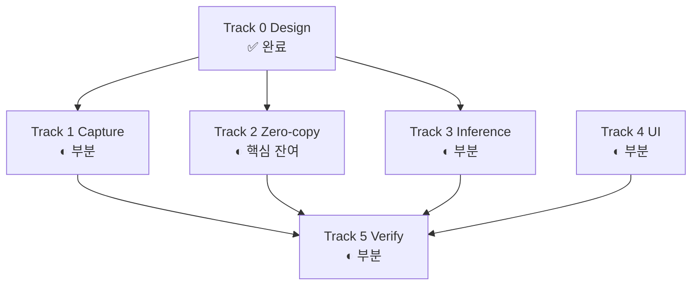

# 개발 현황

`main` 의 [`capture-first/MIGRATION_TASKS.md`](https://github.com/NAMUORI00/display-share/blob/main/capture-first/MIGRATION_TASKS.md) 요약입니다.  
갭·우선순위 다이어그램은 **[개선점](개선점.md)**, 목표 구조는 **[설계안](설계안.md)** 을 보세요.

## 트랙 요약

## 완료된 큰 덩어리

- 레이어 분리: `graphics-d3d11`, `pipeline`, `CaptureFrame::{D3d11,Cpu}`
- Windows 캡처: DXGI 경로, 대상 메타데이터, 프리뷰/분석 채널
- 추론: DirectML + OpenVINO + CPU EP 체인, YOLO 파싱·진단
- UI: 대상 열거, Start/Stop, 미리보기, provider/성능, JSON 저장
- 검증: `cargo check` / `cargo test`, headless 파이프라인 테스트

## 진행 중 · 미완

| 영역 | 항목 |
|------|------|
| Capture | OBS/libobs 어댑터, 보호/미지원 fail-closed |
| Zero-copy | GPU resize·색변환, 추론 핫패스 CPU readback 제거 |
| Inference | 실 onnx 출력 검증, live provider fallback 회귀 |
| UI | 텍스처 네이티브 프리뷰 |
| Verification | Win11 실기 스모크, 4K60 / 1440p240 벤치 |

## 권장 구현 순서

1. ROI resize·preprocess 를 D3D11으로  
2. 추론 경로 CPU readback 제거  
3. 실제 모델 출력 파싱 하드닝  
4. fail-closed · 좌표 매핑  
5. 실기 스모크·벤치  

상세: [개선점](개선점.md) · [파이프라인](파이프라인.md) · [아키텍처](아키텍처.md)
